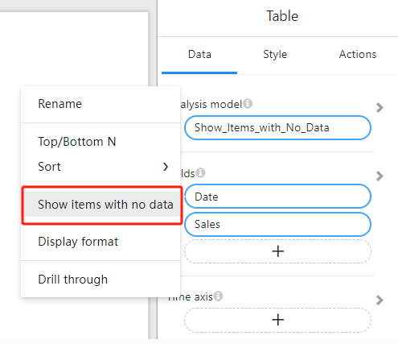
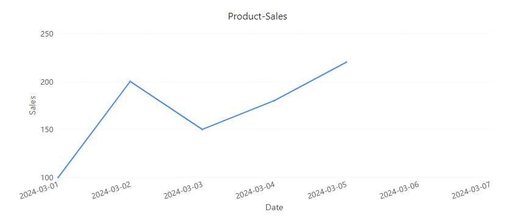
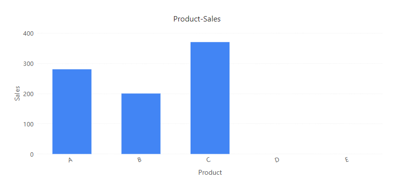

# **Show Items with No Data**

#### **Overview**

The **Show Items with No Data** feature in OptimiBI allows report components such as tables and charts to display dimension values even if they do not have corresponding data. This ensures completeness in data visualization and prevents missing key insights.

## **1. Use Cases**

This feature is useful in the following scenarios:

- **Time Series Analysis**: Ensures all dates appear on the timeline, even if there is no data for certain days.
- **Categorical Analysis**: Displays all product categories, customers, or regions, even if they have no recorded data.
- **Data Quality Monitoring**: Helps identify missing data for certain categories, facilitating further investigation.

## **2. How to Enable "Show Items with No Data"**

1. Select a **chart** or table component.

2. In the **Fields** panel, locate the dimension field you want to display even when it has no data (e.g., product category, date).

3. Open the field’s menu and select **"Show Items with No Data"**.

   

4. The report will now display all values for the selected field, even those without data.

## **3. Example Scenarios**

### **Example Data**

| Date       | Product | Sales   |
| ---------- | ------- | ------- |
| 2024-03-01 | A       | 100     |
| 2024-03-01 | B       | (empty) |
| 2024-03-02 | A       | (empty) |
| 2024-03-02 | B       | 200     |
| 2024-03-02 | C       | (empty) |
| 2024-03-03 | B       | (empty) |
| 2024-03-03 | C       | 150     |
| 2024-03-03 | D       | (empty) |
| 2024-03-03 | E       | (empty) |
| 2024-03-04 | A       | 180     |
| 2024-03-04 | E       | (empty) |
| 2024-03-05 | A       | (empty) |
| 2024-03-05 | B       | (empty) |
| 2024-03-05 | C       | 220     |
| 2024-03-05 | D       | (empty) |
| 2024-03-05 | E       | (empty) |
| 2024-03-06 | C       | (empty) |
| 2024-03-06 | D       | (empty) |
| 2024-03-06 | E       | (empty) |
| 2024-03-07 | A       | (empty) |
| 2024-03-07 | B       | (empty) |
| 2024-03-07 | C       | (empty) |

### **Example 1: Time Series Sales Data**

- **Configuration**: Enable the **"Show Items with No Data"** option for the **Date** field.

- **Effect**:

  - A line chart will display all dates, ensuring gaps do not appear in the timeline due to missing data.
  - Even if sales data is missing for some dates, the entire time range remains visible.

### **Example 2: Product Sales Analysis**

- **Configuration**: Enable the **"Show Items with No Data"** option for the **Product** field.

- **Effect**:

  - The table or matrix visualization will list all products, even if some products have no sales data.
  - This ensures a complete view of all available categories for analysis.

