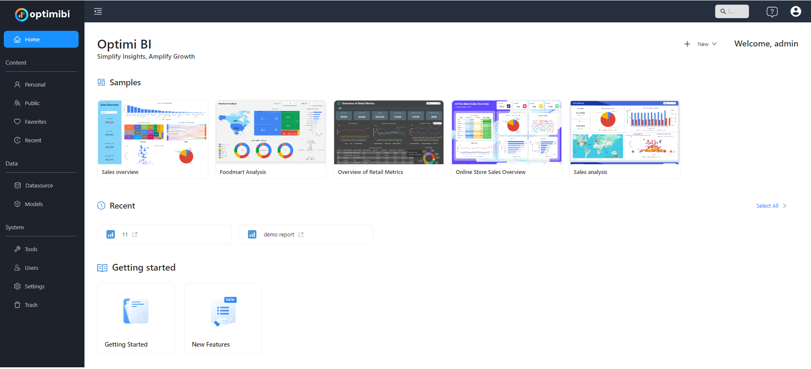
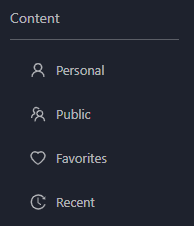
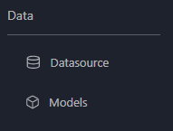
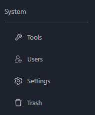

# **Quick Tour of the Console**

## **Introduction**
The Optimibi User Console is designed to provide an intuitive and efficient user experience, helping users manage and analyze data. This guide introduces the main sections of the console to help you get started quickly.

---

## **1. Home Page Overview**
After logging into Optimibi, the **Home** page serves as the central hub for accessing reports, dashboards, and data sources.
- **Samples**: A collection of pre-built reports and dashboards to help users get familiar with the system quickly.
- **Recent**: Displays recently accessed reports for quick navigation.
- **Getting Started**: Provides learning resources for new users to explore Optimibi’s features.

---

## **2. Content Management**
The **Content** section, located in the left-side navigation panel, allows users to manage reports and dashboards:
- **Personal**: Private reports and dashboards visible only to the user.
- **Public**: Shared reports accessible to authorized users.
- **Favorites**: Quickly access frequently used reports.
- **Recent**: View reports that were recently opened.

---

## **3. Data Management**
The **Data** section enables users to configure and manage data sources and models:
- **Datasource**: Connect and manage databases and file-based data sources.
- **Models**: Define relationships between tables, create calculated fields, and prepare data for reporting.

---

## **4. System Administration**
Administrators can manage users and system settings in the **System** section:
- **Tools**: Configure global parameters and system settings.
- **Users**: Manage user accounts, roles, and access permissions.
- **Settings**: Adjust advanced system configurations such as authentication methods and query optimization.
- **Trash**: Restore or permanently delete removed reports and datasets.

---

## **5. User Actions and Navigation**
- Use the **Search Bar** (top-right corner) to quickly locate reports, dashboards, or datasets.
- Click the **Help Icon** to access documentation and support resources.
- Use the **User Profile Menu** to manage account settings and preferences.

---

The Optimibi User Console provides an efficient environment for data management, report creation, and sharing.