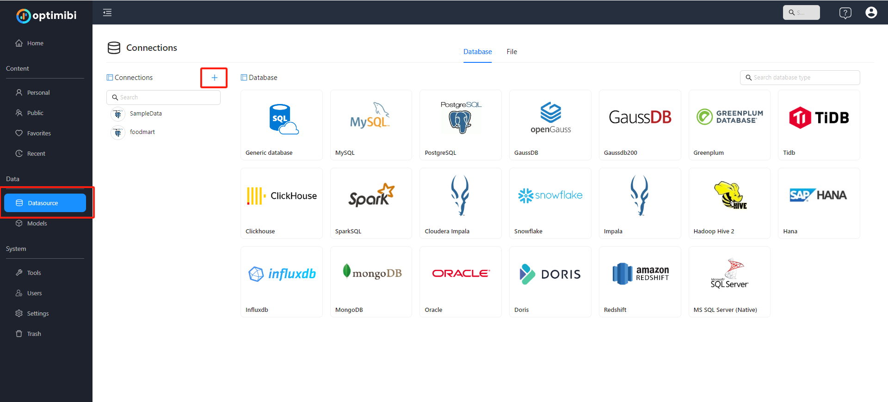
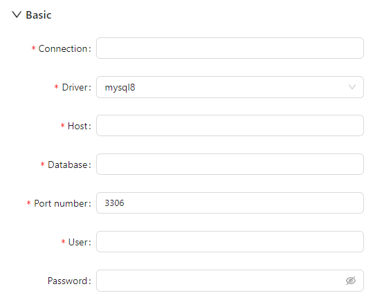
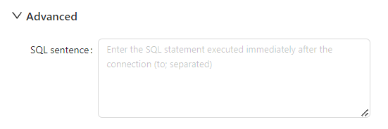
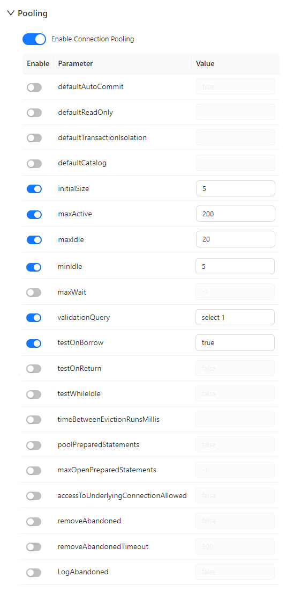

# **Configuring MySQL Data Source**

This guide explains how to configure a MySQL data source in **Optimibi** to ensure proper data connectivity and access.

------

### **1. Access the Data Source Configuration Interface**

1. In the **Optimibi** platform, navigate to **Data Source Management**.

   <div align="left"></div>

2. Click on **MySQL** to enter the JDBC connection configuration interface.

------

### **2. Basic Configuration**

<div align="left"></div>

In the **Basic** configuration section, fill in the following details:

- **Connection (Connection Name)**  
  - Assign a custom name for this data source to facilitate identification in future usage.
- **Driver**  
  - Select `mysql8` (for MySQL 8 and above).
  - If the required driver is not listed or needs updating, refer to the [**[JDBC Driver Management](https://help.optimibi.com/documentation/Datasource/JDBC-Driver-Management/)**] documentation to ensure the correct driver files are loaded in Optimibi.
- **Host (Server Address)**  
  - Enter the MySQL server address, such as `127.0.0.1` or a remote server IP.
- **Database**  
  - Enter the name of the MySQL database to connect to.
- **Port number**  
  - Default is `3306`. Modify if a different port is used by the server.
- **User**  
  - Enter the MySQL username with access to the database.
- **Password**  
  - Enter the corresponding password for the MySQL username.

------

### **3. Advanced Configuration (Optional)**

<div align="left"></div>

In the **Advanced** section, you can enter one or more SQL statements (separated by `;`). These statements will execute immediately after the connection is established. They can be used for session-level variable settings or initialization operations, such as:

```
SET NAMES utf8;
SET SESSION sql_mode='STRICT_TRANS_TABLES';
```

------

### **4. Connection Options**

<div align="left"></div>

The **Option** section allows setting additional JDBC parameters to meet different connection requirements:

- **databaseTerm**: Defines the database term, default is `schema`.
- **useSSL**: Whether to use SSL for the connection, default is `false` (disabled).
- **useUnicode**: Whether to enable Unicode support, default is `true`.
- **characterEncoding**: Character encoding, default is `utf8`.
- **serverTimezone**: Server timezone, e.g., `Australia/Melbourne`, adjustable as needed.

To add more custom parameters, click **“+ New”** to define new key-value pairs.

------

### **5. Connection Pooling Configuration**

<div align="left"></div>

Enabling **Connection Pooling** improves database access performance and ensures stable operation in high-concurrency environments. Configuration parameters include:

#### **Core Parameters**

- **initialSize**: Initial connection count, default `5`.
- **maxActive**: Maximum connections, default `200`.
- **maxIdle**: Maximum idle connections, default `20`.
- **minIdle**: Minimum idle connections, default `5`.
- **maxWait**: Maximum wait time for obtaining a connection (milliseconds), default `-1` (unlimited).

#### **Validation Mechanism**

- **validationQuery**: SQL statement to check connection validity, default `select 1`.
- **testOnBorrow**: Validate connection when borrowed from the pool, default `true` (enabled).

#### **Other Settings (Optional)**

- **testOnReturn**: Validate connection upon return.
- **testWhileIdle**: Validate connection during idle time.
- **removeAbandoned** and **logAbandoned**: Whether to clean up long-unused connections and log them.
- **poolPreparedStatements**, **maxOpenPreparedStatements**: Whether to pool PreparedStatement objects.

Proper configuration of connection pooling enhances system performance and reduces database load.

------

### **6. Save and Test Connection**

1. After filling in all configurations, click **Save**.
2. Use the **Test Connection** feature to verify successful connectivity.
3. If the connection fails, check the following:
   - **Server address** and **port number** are correct.
   - **Username** and **password** are entered correctly.
   - The database server allows remote access.
   - Advanced parameters (e.g., SSL, time zone) match the actual database settings.
   - The correct driver version is loaded (refer to the [**[JDBC Driver Management](/documentation/Datasource/JDBC-Driver-Management/)**] documentation).