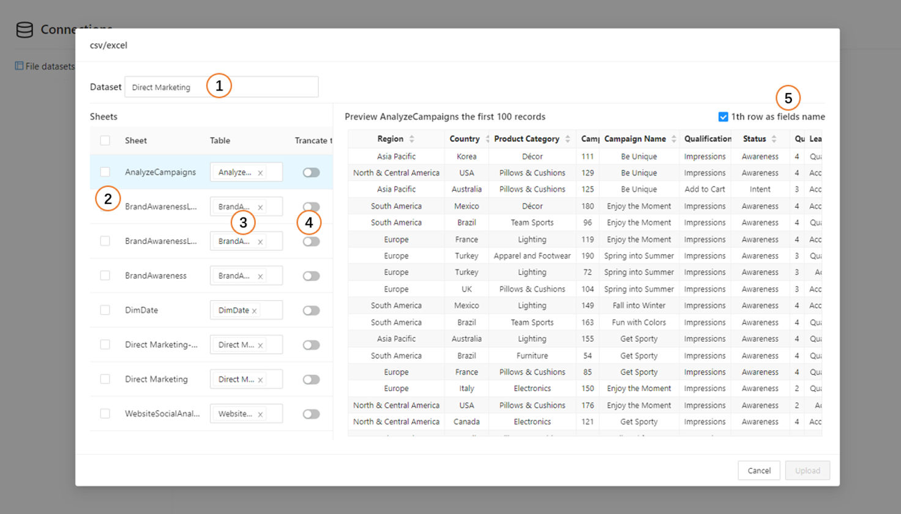

# File Dataset

Microsoft Excel and CSV files are among the most commonly used formats for importing data into Optimibi.  

Optimibi supports importing workbooks created in Excel 2007 and later, provided they are saved in the `.xlsx` or `.xlsm` file formats.  

## Importing Excel Data

To import an Excel file into Optimibi, follow these steps:  

1. Navigate to **Datasource** in the Optimibi menu and switch to the **Files** tab. 

   

2. Click the **CSV/Excel** button and select the desired file from your local system.  

3. Configure the import settings:  

   

   | No.  | Description |
   |------|---------------------------------------------------------------|
   | 1    | Specify a dataset name |
   | 2    | Choose the **Sheet** to be imported |
   | 3    | Define the corresponding table name for the selected sheet (multiple sheets can share the same table name) |
   | 4    | Specify whether to clear existing data in the table before import |
   | 5    | Indicate whether the first row of the sheet should be treated as the header row |

4. Click **Upload** to import the data from the selected file.  

   

## **Appending Data from an Imported File**  

To append data to an existing dataset:  

1. Click **Import**, then select the file to be appended.  

   

2. Choose the sheet and either select an existing table or define a new table for the imported data.  

   

3. Click **Upload** to append the data. The newly imported records will appear in the dataset list.  

   

## **Importing CSV Files**  

The process for importing CSV files into Optimibi is similar to that for Excel files:  

1. Navigate to **Datasource** in the Optimibi menu, select the **Files** tab, then click the **CSV/Excel** icon to choose a local CSV file.  

2. Configure the CSV import settings:  

   

   | No.  | Description |
   |------|-------------------------------|
   | 1    | Specify a dataset name |
   | 2    | Define the name of the target table |
   | 3    | Select the character encoding of the CSV file |
   | 4    | Specify the delimiter used in the CSV file |

