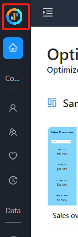
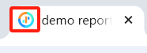
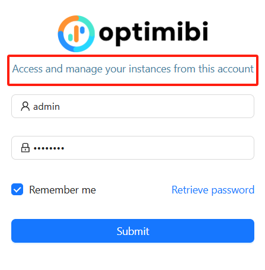
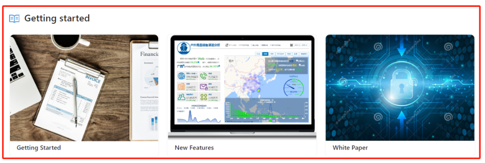

# **White Label**

## **Overview**
OptimiBI allows administrators to customize the platform’s branding through **White Label Configuration**. This includes modifying logos, website icons, copyright statements, and software titles to align with corporate branding.

## **Accessing White Label Configuration**
To configure branding settings:
- Navigate to **Settings** in the left sidebar.
- Select **White Label Configuration** from the menu.

## **Branding Elements & Customization**

### **Login Page Logo**
- Displays on the login page.
- **Format**: PNG.
- **Recommended Aspect Ratio**: **4.2:1**, dark-colored logo with a transparent background.
- Click **"Upload to Replace"** to update.

### **Home Page Logo**
- Displays in the top navigation bar.
- **Format**: PNG.
- **Recommended Aspect Ratio**: **4.2:1**, light-colored logo with a transparent background.
- Click **"Upload to Replace"** to update.

### **Home Page Collapsed Logo**
- Displays when the navigation menu is collapsed.
- **Format**: PNG.
- **Recommended Aspect Ratio**: **1:1**, light-colored logo with a transparent background.
- Click **"Upload to Replace"** to update.

### **Website Icon (Favicon)**
- Small icon displayed in browser tabs.
- **Format**: ICO.
- **Recommended Size**: **32px × 32px** or **48px × 48px**.
- Click **"Upload to Replace"** to update.

### **Login Page Description**
- Brief text displayed on the login page.
- Enter a custom description in the provided text field.

### **Copyright Statement**
- Displays copyright information for the software.
- Enter the company’s copyright text, e.g., **"©2025 OptimiBI"**.

### **Software Name Title**
- Sets the primary software name displayed on the home page.
- Enter the preferred software name.

### **Software Name Subtitle**
- A tagline or additional descriptive text for the software.
- Enter a short description, e.g., **"Optimized Analytics, Embedded for Success"**.

## **Additional Display Options**

### **Show Help Menu**
- Enables the built-in system help menu.
- Toggle **on/off** to enable or disable.

### **Getting Started**
- A dedicated section on the home page providing quick access to resources such as user guides, feature overviews, and white papers.

