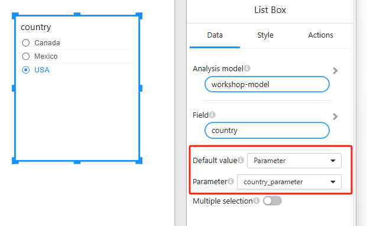
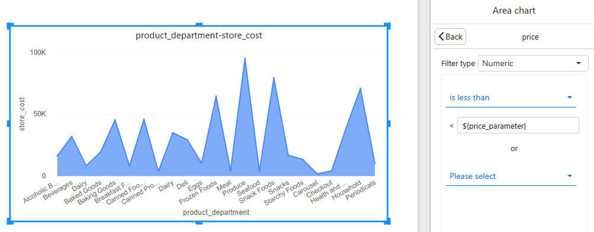
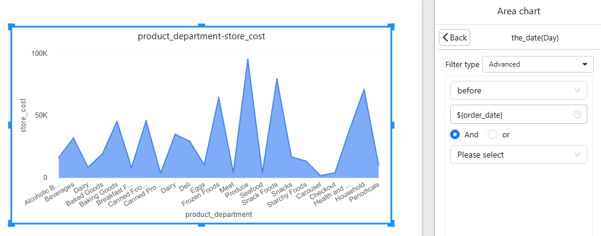

# Pass parameters through URL

### Overview

Optimibi enables users to dynamically modify the default filter values in reports and the data filtering values in chart components through URL parameters. This feature is particularly useful when embedding reports and dashboards into external systems. By leveraging external systems, users can control the default display content of the report and filter the data. Filters manage the default display, while chart component filters control the data being presented in the report.

### Create Parameters

Reference document: [Parameters](https://help.optimibi.com/documentation/Analysis/Parameters/)

### Default Filter Values

The default filter values can be set to one of the following three types:

1. **Fixed Value**: A static value defined by the report creator.
2. **Relative Value**: A dynamically adjusted value based on certain criteria, such as the "first" or "last" item in a list.
3. **Parameter Value**: A dynamic value passed via the URL or parameter filters. When the report is opened, the default value is updated based on the passed parameter.

#### Using Parameter Values for Default Filter Settings

When the default value of a filter is set to **Parameter Value**, it can be modified via URL parameters. The steps are as follows:

- **Step 1**: Set the default value of the filter to "Parameter Value" in the filter configuration.

- **Step 2**: Select a parameter for the filter.

  

- **Step 3**: When opening the report, include the parameter in the URL, formatted as:
   `?parameter_name=value`

  For example, to set the default value of the region filter to "North America", the URL would look like:
   `https://your-report-url.com?country_parameter=Mexico`

Additionally, you can use **parameter filters** to modify the parameter value and thus influence the default filter values.

### Filter Types for Chart Components

In Optimibi, chart components allow users to filter data. The filter fields can be of different data types:

- **Text**
- **Number**
- **Date**

#### Numeric Type Filters

For numeric fields, you can choose from the following comparison operators:

- Greater than

- Less than

- Greater than or equal to

- Less than or equal to

- Equal to

  

These comparison operators can be used with specific values or parameter values passed via the URL. For example, a filter might use the following URL to filter the data:
 `https://your-report-url.com?price>={price_parameter}`
 This will filter records where the price is greater than or equal to the value passed in the `price_parameter`.

#### Date Type Filters

For date fields, you can choose from the following comparison operators:

- Before

- Before or equal to

- Equal to

- After

- After or equal to

  

These comparison operators can be used with specific dates or parameter values passed via the URL. For example, a filter might use the following URL to filter the data:
 `https://your-report-url.com?order_date>=2023-01-01`
 This will filter records with an order date greater than or equal to January 1, 2023.

> [!IMPORTANT]
>
> The URL-passed date parameters support the following formats:
>
> - yyyy
> - yyyy-MM
> - yyyy-MM-dd
> - yyyy-MM-dd HH
> - yyyy-MM-dd HH:mm
> - yyyy-MM-dd HH:mm:ss
> - yyyy-MM-dd HH:mm:ss.[S]{1-6}
>    Additionally, the ISO 8601 date-time format is supported, such as `2025-02-21T06:24:48-05:00`, which represents the UTC-5 timezone (Eastern Standard Time, EST).

### Complete Example

Here is an example of a URL that includes parameters for default filter values and chart component filters:
 `https://your-report-url.com?country_parameter=Mexico&price_parameter=1000&order_date=2023-01-01`

- The `Country` filter will have its **default value** set to "North America".
- The `Area chat`  will display records where the price is **less than** 1000.
- The `Area chat`  will display records where the order date is **before** January 1, 2023.

