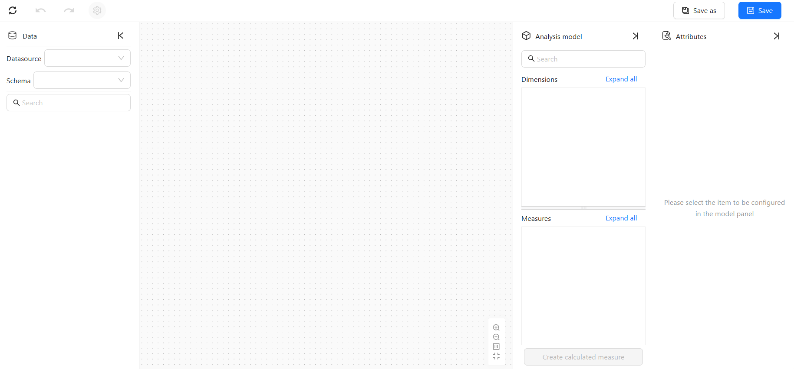
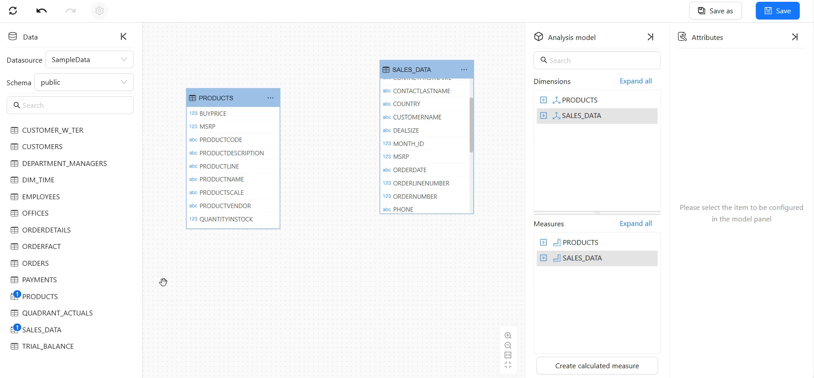
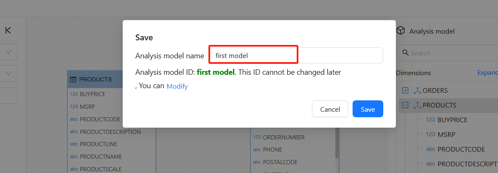

An analysis model is the foundation of data analysis and visualization in Datafor BI. Before creating an analysis model, ensure that you have configured a **database data source** or a **file dataset** to provide data for the model.

## Steps to Create an Analysis Model

### 1. **Access the Model List**  
Navigate to **Model Management** in the Datafor BI platform and click the "+" button to create a new model.

### 2. **Open the Model Editor**  
Enter the **Model Editor**, which provides a visual interface to configure your data model.

### 3. **Select a Data Source and Schema**  
- Choose the appropriate **data source**.  
- Select the **database schema** to ensure the correct data source is used.  

### 4. **Add Tables or Views**  
- Select the required **tables or views** from the left data panel.  
- **Drag and drop** tables or views into the canvas to build the model structure.  

### 5. **Establish Table Relationships**  
- Drag and drop fields to connect **primary keys (PK)** and **foreign keys (FK)** to establish relationships between tables.  

### 6. **Save the Model**  
- Click the "**Save**" button, enter a model name, and confirm the save action.  

- **Once the model is saved**, it can be used in visualization tools such as dashboards for data analysis.  

Following these steps, you can successfully create a basic analysis model.

## Related Topics  
- [Creating Hierarchies on Dimensions]()  
- [Creating Calculated Fields]()  
- [Creating Calculated Measures]()  
- [Relationships Between Tables]()  

