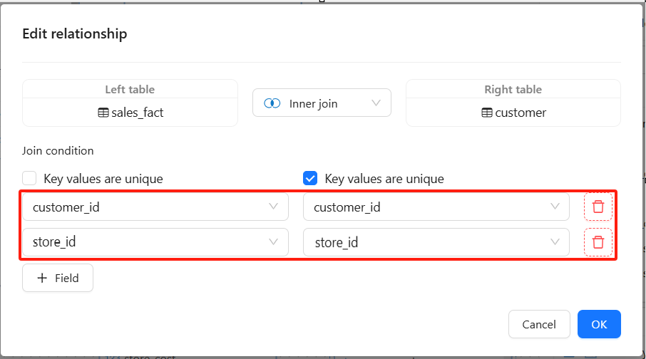
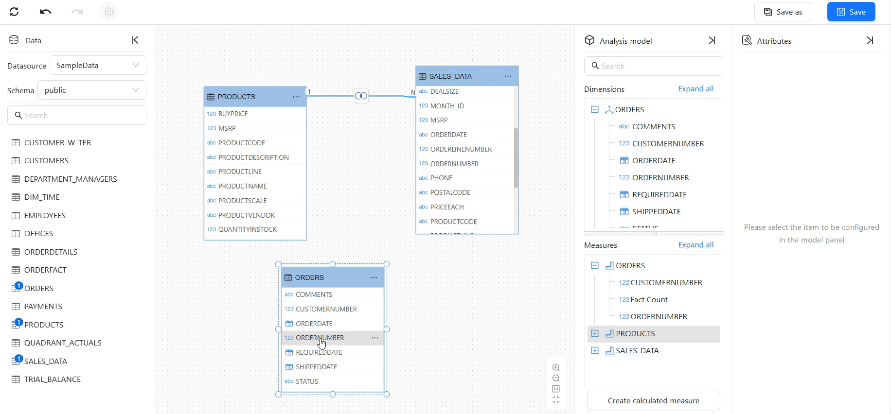
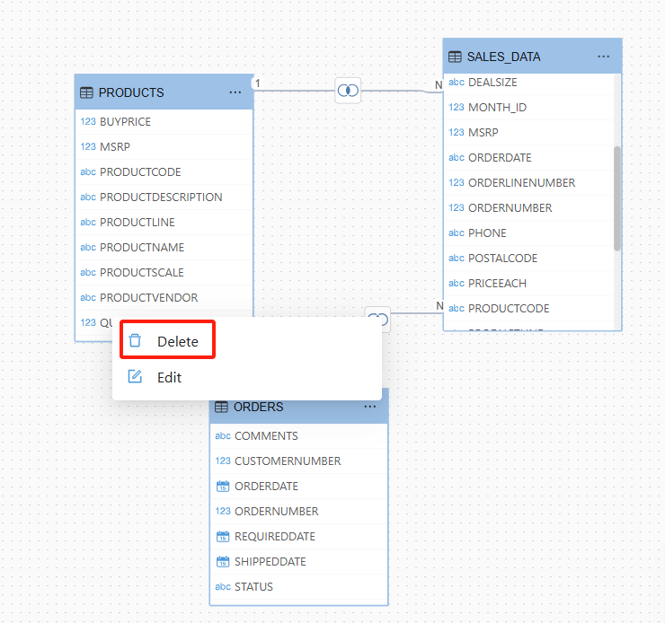

# Establishing Table Relationships

## What Are Table Relationships?

**Table relationships** connect different data tables, allowing users to perform cross-table queries, aggregations, and calculations without manually writing SQL joins.  

### **Supported Join Types**  
When establishing table relationships, the following **four types of joins** are supported:  

- **Inner Join** (default): Returns only matching data from both tables.  

- **Left Join**: Returns all data from the left table; unmatched records from the right table are filled with NULL.  

- **Right Join**: Returns all data from the right table; unmatched records from the left table are filled with NULL.  

- **Full Join**: Returns all data from both tables, with NULL values for unmatched records.  

  

### **Supported Relationship Types**  
Supports **one-to-one (1:1)** and **one-to-many (1:N)** relationships, determined by the **"Unique Key"** toggle:  

- **Enabled** → The field has unique values, representing the **"1"** side.  

- **Disabled** → The field has non-unique values, representing the **"N"** side.  

  

### **Support for Composite Keys**  
Datafor BI allows multiple fields to be combined into a **composite key** to establish table relationships. This is useful when no single field uniquely identifies records. For example:  

- The `sales_fact` table may need to use both `customer_id` and `store_id` as a composite key to match records in the `customer` table.  

- Users can click the **"➕ Field"** button to add multiple fields for matching, improving data association accuracy.  

  

## How to Create Table Relationships?

### Step 1:
Select the desired model and open the **Model Editor**.  

### Step 2: 
Drag and drop fields to connect **primary keys (PKs)** and **foreign keys (FKs)** to establish relationships between tables.  

### Step 3：
Define join types, primary and foreign key fields, and relationship types based on the data model.  

### Step 4: 
- Click **OK** to close the relationship settings.  

## Modifying and Deleting Table Relationships
### Modifying Table Relationships

Double-click the relationship line or right-click it and select **Edit** from the context menu.  

### Deleting Table Relationships

Right-click the relationship line and select **Delete** from the context menu.  

