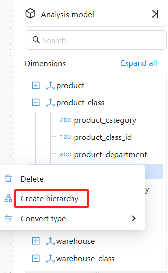
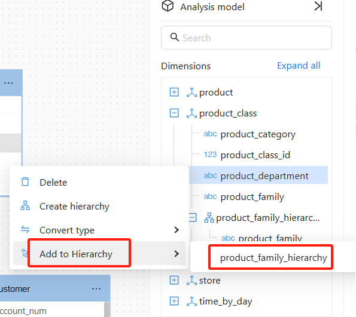
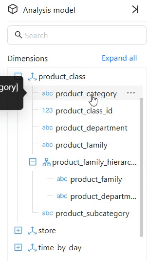
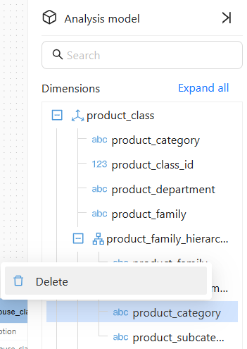
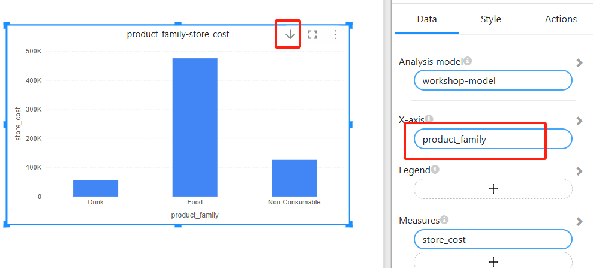

# Creating Hierarchy

## **1. What is a Hierarchy?** 

A hierarchy is a structure used to represent the layered relationship of data, typically applied in time, geography, organizational structure, etc. Here are some examples: 
- **Time Hierarchy**: Year → Quarter → Month → Day 
- **Geography Hierarchy**: Country → State → City 
- **Product Hierarchy**: Category → Subcategory → Product Name 

After creating a hierarchy, users can analyze data step by step based on the hierarchy in reports, making it easier to aggregate and drill down into the data.

---

## **2. How to Create a Hierarchy?** 

### **2.1 Access the Model Editor** 
1. **Select a model** and enter the **Model Editor**. 

   

### **2.2 Create Hierarchy** 

1. In the model area, select the field to create a hierarchy, such as **product_family**. 

   

2. **Right-click the field** or **use the menu** to select "**Create Hierarchy**".

    
   
3. Below the field, a hierarchy **product_family_hierarchy** is generated, which contains the selected field **product_family**.

   

4. Add other fields to the hierarchy.

   - Right-click the **product_department** field or use the field menu, select **Add to Hierarchy** → **product_family_hierarchy** to add the field to the hierarchy.

     

   - Drag and drop the field into the hierarchy.

     

5. Add **product_category** and **product_subcategory** to the hierarchy structure sequentially.  

   

6. Save the model to complete the hierarchy creation.

---

### **2.3 Adjust the Hierarchy Relationship** 
   In the **Hierarchy Management Interface**, drag and drop fields to adjust their order according to the logical structure. 
   

### **2.4 Delete a Hierarchy** 
- **Right-click the hierarchy** and select "Delete Hierarchy" to remove the hierarchy, without deleting the original fields. 

   

## 3. Using Hierarchies in Visualization

### **3.1 Add Hierarchy to a Visualization Component** 
1. In the **Analysis Report Editor**, select a visualization component that supports hierarchies (e.g., bar chart, line chart). 

2. Drag the created hierarchy into the **X-axis or Y-axis**. 

3. The **Enable Drill Down** button will appear in the chart toolbar. Once enabled, you can **drill down by hierarchy** to view more detailed data.

   

---

## **5. Hierarchy Use Cases** 

| **Scenario**       | **Example Hierarchy**      |
|-------------------|-------------------------|
| **Time Analysis**  | Year → Quarter → Month → Day |
| **Geography Analysis**  | Country → State → City |
| **Product Classification**  | Category → Subcategory → Product |
| **Sales Channel Analysis**  | Region → State → Salesperson |

---

**📌 Related Content** 

- [How to Manage Data Models]() 
- [How to Create Calculated Fields]() 
- [How to Set Data Filters]() 
- [How to Establish Table Relationships]() 
