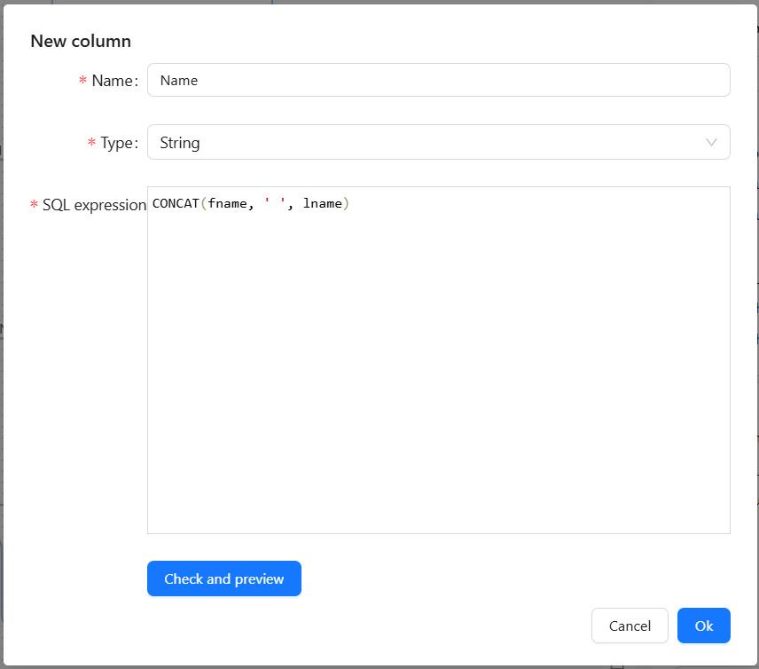
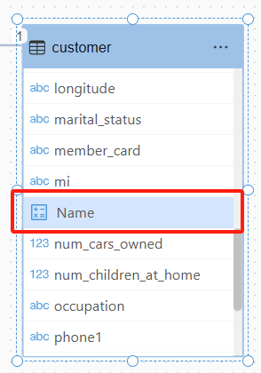
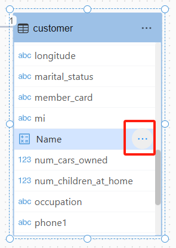
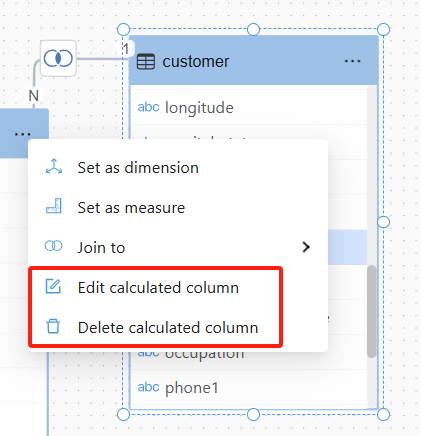

# Calculated Field

A **Calculated Field** is a new field created in tables and views through custom SQL expressions. The SQL syntax for the calculated field must adhere to the database type specification of the data source used in the model.

## Accessing the Calculated Field Feature

Select the "New column" menu from the table view's menu.

<div align="left"></div>

## Setting Up a Calculated Field

<div align="left"></div>

1. **Name the Field**: In the pop-up window, enter the name for the new calculated field.

2. **Write the SQL Formula**:

   - Use SQL syntax that complies with the data source's database type.

   - Supports mathematical operations (+, -, *, /), string operations, conditional statements (CASE WHEN), etc.

   - Example:

     ```sql
     CONCAT(fname, ' ', lname)
     ```

3. **Select Data Type**: Choose the appropriate data type based on the calculation result (e.g., numeric, text, date, etc.).

4. **Validate SQL Syntax**: Use the "Test" or "Validate" button to check the correctness of the SQL syntax.

5. **Save the Calculated Field**: Once everything is correct, click the "Save" or "Apply" button.

## Using the Calculated Field

- The created calculated field will appear in the table view.

  <div align="left"></div>

- The calculated field can be set as a dimension or measure field in the analytical model.

  <div align="left"></div>

## Editing and Deleting a Calculated Field

Click on the calculated field menu.

<div align="left"></div>

Choose "Edit Calculated Field" or "Delete Calculated Field."

<div align="left"></div>

## Notes

- The SQL syntax for the calculated field must meet the requirements of the data source's database type.
- If using aggregate functions (such as SUM, AVG), ensure the grouping level is correct.
- The data table field names must match the SQL formula, or errors may occur.
- The performance of calculated fields may be affected by the volume of data. It's recommended to optimize the SQL query for better performance.
