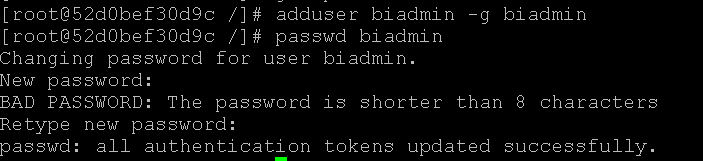
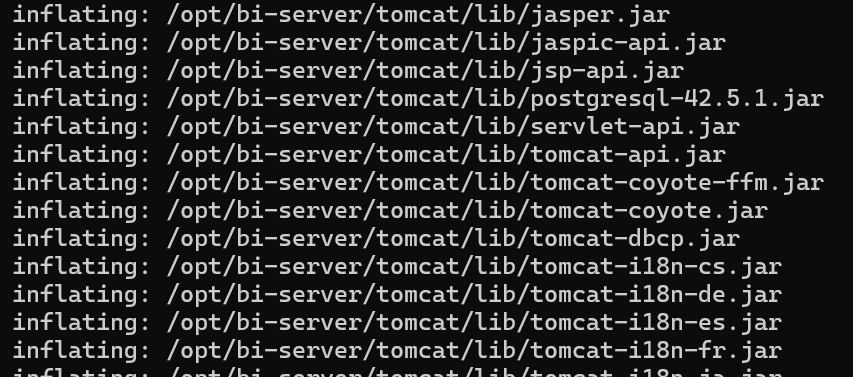
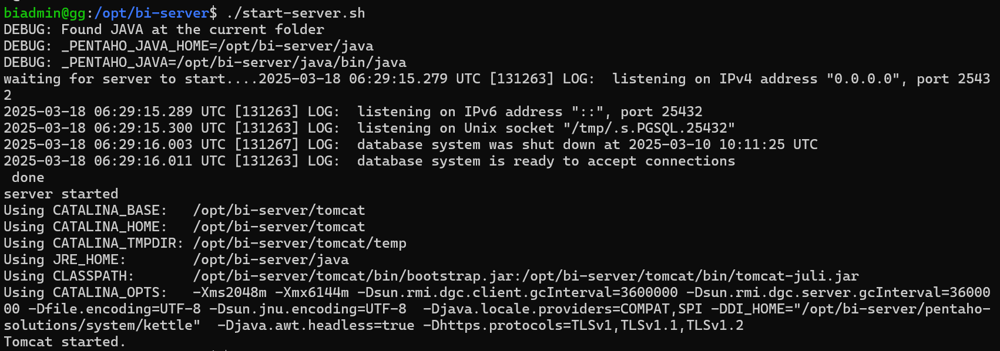
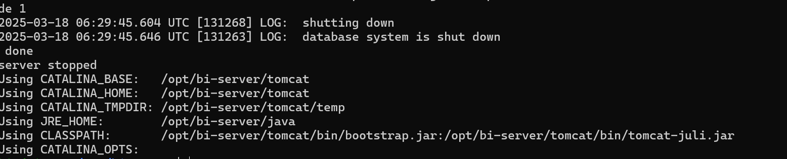
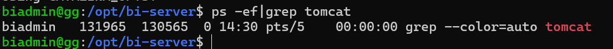

# Optimibi Installation (CentOS)

**Step 1. Switch to the root user**

```
sudo su root
```

<div align="left"></div>

**Step 2. Create the 'biadmin' user group**

```
groupadd biadmin
```

<div align="left"></div>

**Step 3. Create the 'biadmin' user, add it to the 'biadmin' user group, and set the user password to 'biadmin' as well.**

```
adduser biadmin -g biadmin
passwd biadmin
```

<div align="left"></div>

**Step 4. Navigate to the directory containing the installation package and extract the package to the /opt directory.**

```
unzip -o optimibi-linux-7.02.zip -d /opt/
```

<div align="left"></div>

**Step 5. After extracting, go to the /opt/ directory and modify permissions.**

```
cd /opt/
chmod -R 700 bi-server
chown -R biadmin:biadmin bi-server
```

<div align="left"></div>

**Installation completed.**


## Start OptimiBI

**Please operate as the 'biadmin' user**

```
su biadmin
cd /opt/bi-server/
```

**Start the service**

```
./start-server.sh
```

<div align="left"></div>

**Stop Service**

```
./stop-server.sh
```

<div align="left"></div>

**Check Service Start/Stop Status**

```
ps -ef|grep tomcat
```

<div align="left"></div>

If the command produces the above output, it indicates that the service is in a running state.


## Login

URL:  `http://localhost:28080/`

username  /  password

- `admin` / `password`
- `demo` / `demo`

## Update the System

Place the update package such as `optimibi-update.jar` in the `bi-server\update` folder and restart the system.