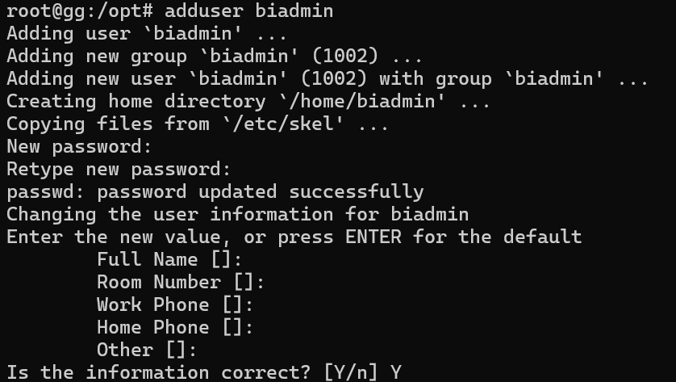
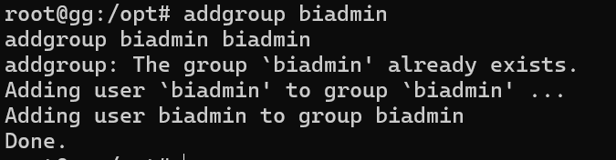
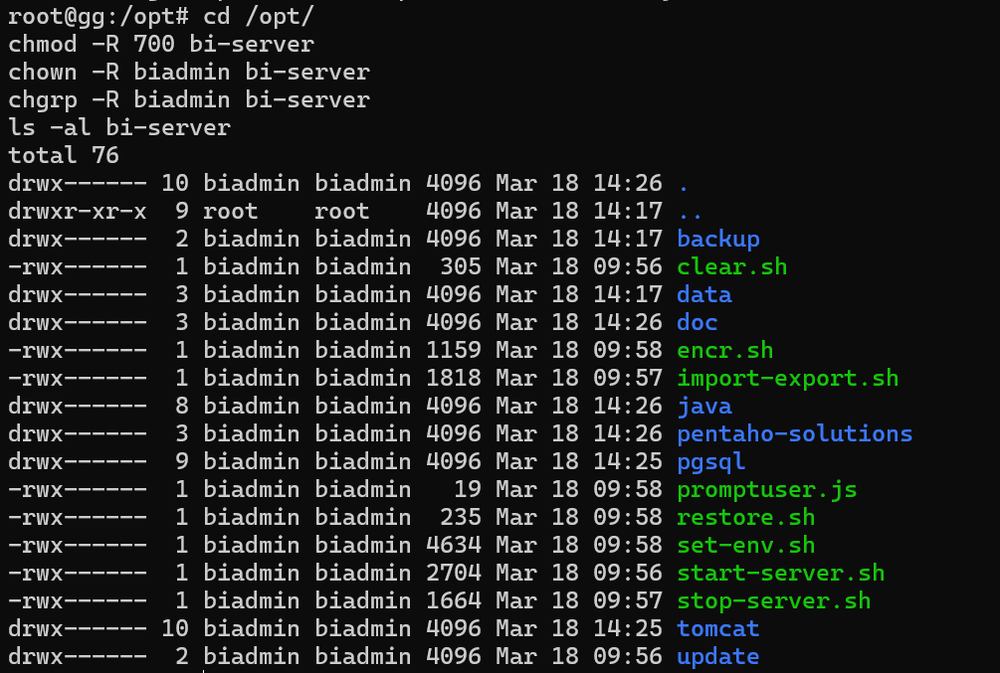

# Optimi BI Installation (Ubuntu)
## Installation Steps

**Step 1. Switch to the root user**

```
sudo su  
```

<div align="left"></div>

**Step 2. Create the "optimibi" user, and set the user password to "optimibi" as well.**

```
adduser optimibi
```

<div align="left"></div>

**Step 3. Create a user group and add the "optimibi" user to the "optimibi" user group.**

```
addgroup optimibi
addgroup optimibi optimibi
```

<div align="left"></div>

**Step 4. Navigate to the directory where the installation package is located and unzip the package to the /opt path.**

```
unzip -o optimibi-server_202203210834.zip -d /opt/
```

<div align="left"></div>

**Step 5. After the extraction is complete, go to the /opt/ directory and modify permissions.**

```
cd /opt/
chmod -R 700 optimibi-server
chown -R optimibi optimibi-server
chgrp -R optimibi optimibi-server
```

<div align="left"></div>

**Installation Completed**

Start or stop the service, refer to daily startup procedures.

## Startup

**For daily startup and shutdown, please perform the operations using the "optimibi" user.**

```
su optimibi
cd /opt/optimibi-server/
```

**Start the service**

```
./start-optimibi.sh
```

<div align="left"></div>

**Stop the service**

```
./stop-optimibi.sh
```

<div align="left"></div>

**Check the status of the service startup and shutdown**

```
ps -ef|grep tomcat
```

<div align="left"></div>

**If the command outputs as above, it indicates that the service is in a running state.**

## Login

URL:  `http://localhost:28080/`

username  /  password

- `admin` / `password`
- `demo` / `demo`

## Update the System

Place the update package `optimibi-upload.jar` in the `optimibi-server\update` folder and restart the system.