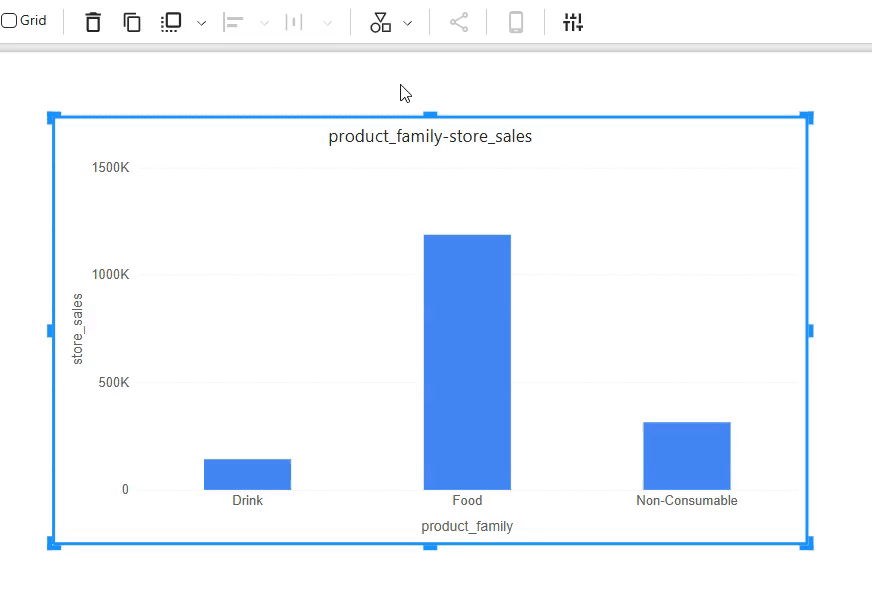

# **Basic Operations for Report Design**

OptimiBI provides powerful and flexible dashboard and report creation capabilities, allowing users to efficiently manage and adjust visualization components on the canvas. This document introduces key operations, including adding, deleting, resizing, moving, aligning, distributing, layering, switching types, and copying components.

## **1. Adding and Deleting Components**

### **Adding Components**

- Select the desired component type from the right-side component panel.

- Click on the selected component. Click on the canvas or drag and drop it to add it to the report canvas.

  

- In the data panel, select an analysis model and add data fields (e.g., X-axis, Legend, Measures) to populate data.

  

### **Deleting Components**

- Click to select the component you want to delete, or press **Ctrl + Click** to select multiple components.

- Press the **Delete** key, or click the **“Delete”** button on the toolbar to remove the component.

  

## **2. Resizing Components**

### **Using Drag Handles**

- Select the component and drag the resize handles at the corners or edges to adjust its size.

  

### **Specifying Exact Width and Height**

- Enter the width and height values directly in the toolbar’s input fields for precise adjustments, particularly useful for resizing multiple components simultaneously.

  

## **3. Moving Components**

### **Drag and Drop**

- Select one or multiple components and drag them to the desired position on the canvas.

## **4. Aligning and Distributing Components**

### **Aligning Components**

- Hold **Ctrl** and click multiple components to select them.

- Click the **“Align”** button on the toolbar and choose the desired alignment option (left, center, right, etc.).

  

  

### **Distributing Components**

- Select multiple components.

- Click the **“Distribute”** button on the toolbar and choose **horizontal distribution** or **vertical distribution** to evenly space them.

  

## **5. Layering Components**

Click the **“Layer”** button on the toolbar to adjust its position in the layering order (bring forward, send backward, bring to front, send to back).

## **6. Copying and Pasting Components**

OptimiBI supports copying, cutting, and pasting single or multiple components, including cross-page operations.

### **Using Toolbar Buttons**
- Select the components and click the **“Clone”** button on the toolbar.

  

### **Using Keyboard Shortcuts**
- **Ctrl + C** (Copy), **Ctrl + X** (Cut), **Ctrl + V** (Paste).

## **7. Switching Component Types**

During the design process, users can switch component types while retaining the original data model to accommodate different visualization needs.

- Select the component and click the **“Switch Type”** button on the toolbar.

- Choose the target component type, and the system will automatically update the visualization.

  

