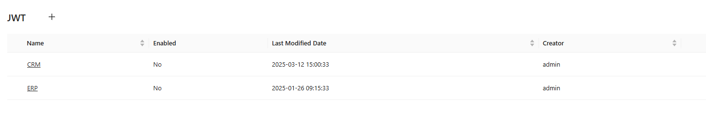
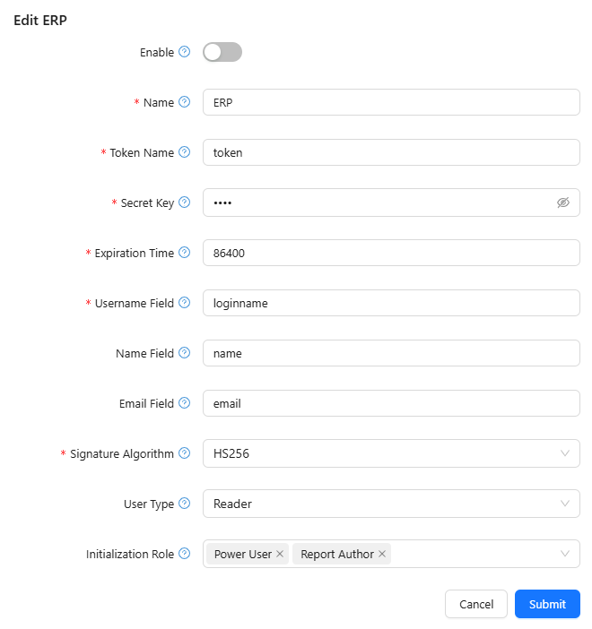
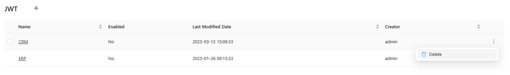

# JSON Web Token (JWT)

## Overview

Optimibi supports JSON Web Token (JWT) authentication, allowing external systems to integrate securely using JWT-based authentication mechanisms. This document provides details on configuring and managing JWT settings within Optimibi.

## Accessing JWT Settings

1. Navigate to **Settings**.
2. Click on **JWT** from the left panel.
3. The JWT configuration list displays existing configurations, including:
   - **Name**: The unique identifier for the configuration.
   - **Enabled**: Indicates if the configuration is active.
   - **Last Modified Date**: The most recent update timestamp.
   - **Creator**: The user who created the configuration.
4. Click on a configuration to edit or click the **+** icon to create a new JWT configuration.

## Creating or Editing a JWT Configuration

To create or modify a JWT configuration:

1. **Enable**: Toggle this setting to enable or disable JWT authentication for this configuration.
2. **Name** (*Required*): Define a unique name for the JWT configuration (e.g., "ERP").
3. **Token Name** (*Required*): Specify the name of the token field (e.g., "token").
4. **Secret Key** (*Required*): Enter the secret key used for signing the JWT. This should be kept secure.
5. **Expiration Time** (*Required*): Define the validity period of the JWT in seconds (e.g., "86400" for 24 hours).
6. **Username Field** (*Required*): Specify the field in the JWT payload that maps to the user's username (e.g., "loginname").
7. **Name Field**: Define the field in the JWT that maps to the user’s full name (e.g., "name").
8. **Email Field**: Specify the field in the JWT that maps to the user’s email (e.g., "email").
9. **Signature Algorithm** (*Required*): Select the algorithm used to generate and verify the JWT signature (e.g., "HS256").
10. **User Type**: Choose the default user type assigned to users authenticating via JWT (e.g., "Reader").
11. **Initialization Role**: Select one or more roles assigned to users upon their first login via JWT authentication.
12. Click **Submit** to save changes or **Cancel** to discard modifications.

## Deleting a JWT Configuration

1. Select the configuration from the JWT list.
2. Click the **Delete** button.
3. Confirm the deletion when prompted.

## Notes

- The **Secret Key** should be kept confidential and should not be shared publicly.
- JWT authentication enables seamless integration with external applications such as CRM and ERP systems.
- Ensure the expiration time is set appropriately to balance security and usability.
- If a username field is incorrectly mapped, authentication may fail.

## Troubleshooting

| Issue                      | Possible Cause                   | Solution                                                   |
| -------------------------- | -------------------------------- | ---------------------------------------------------------- |
| JWT authentication fails   | Incorrect secret key             | Verify the secret key used for signing JWT.                |
| User cannot log in via JWT | Incorrect username field mapping | Ensure the **Username Field** is correctly set.            |
| Token expires too quickly  | Expiration time is too short     | Increase the **Expiration Time** value.                    |
| Unauthorized access        | Signature algorithm mismatch     | Ensure the algorithm matches the external system settings. |