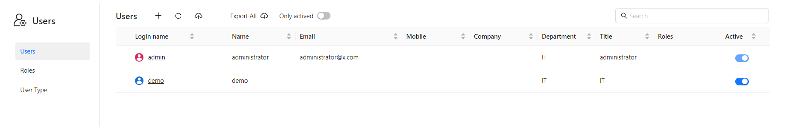
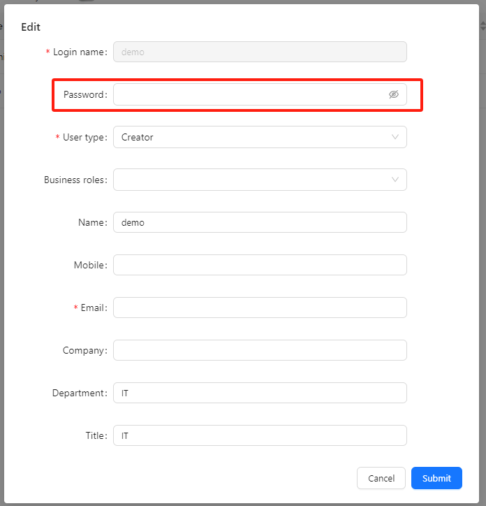
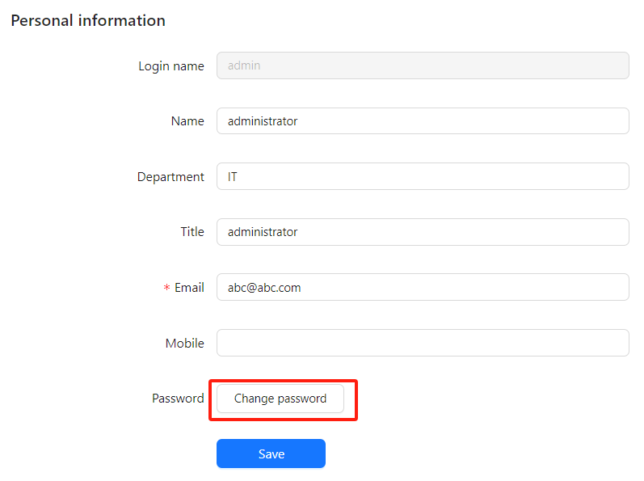

# Modify Password

To enhance security or address password concerns (such as a compromised password), users may need to change their password.

## Changing Your Password

### 1. Change Password via Administrator

Both "Administrator" and "Manager" users in Datafor BI have the privilege to modify passwords for other users.

**Steps:**

1. Navigate to **System** -> **Users**.

   

2. Click on the user whose password needs to be updated.

   

3. In the user editor, enter the new password in the **Password** field and save the changes.

   

### 2. Change Password Yourself

If you are a regular user, you can change your own password from the **My Account** page.

**Steps:**

1. Go to **My Account**.

   

2. Click **Change password** button

   

3. Enter your **current password** and **new password**.

   

4.  Save the changes.