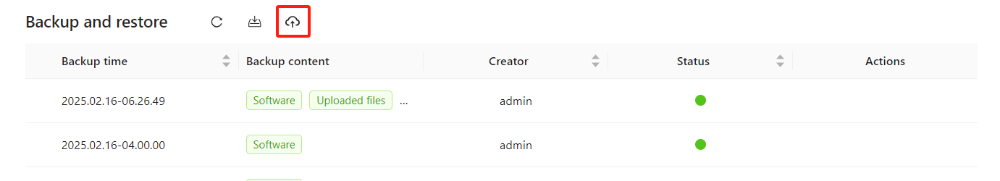
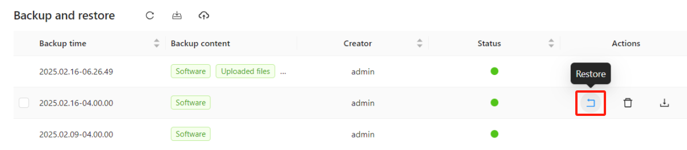
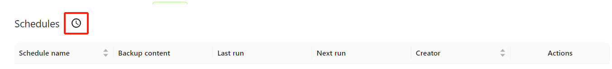

# **Backup and Restore**

## **Overview**

OptimiBI provides **backup, restore, and backup upload** functionalities to ensure data security and availability. Users can **perform manual backups**, **schedule automatic backups**, and **upload locally stored backup packages** for restoration when needed.

## **1. Backup Content**

OptimiBI allows users to select from the following backup types:

- **Software**: Includes OptimiBI **core software and plugins**, enabling system software restoration.
- **Database**: Contains **user information, analytical models, reports, and configuration settings**, ensuring data integrity.
- **Uploaded Files**: Includes **user-uploaded datasets such as Excel and CSV files**, preserving external data sources.

## **2. Backup Management Interface**

### **Key Function Buttons**

The **“Backup and Restore”** interface provides two essential operations:

1. **Backup Button** (Manual Backup): Initiates a new system backup.

   

2. **Upload Button** (Upload Backup Package): Uploads a locally stored backup file to restore data.

   

### **Backup Records**

Users can view all previously created backups, including:

- **Backup Time**
- **Backup Content**
- **Creator**
- **Status:**
  - 🟢 **Green**: Backup successful
  - 🟡 **Yellow**: Backup in progress
  - 🔴 **Red**: Backup failed

## **3. Backup Operations**

### **3.1 Performing a Manual Backup**

**Steps:**

1. In the **“Backup and Restore”** interface, click the **Backup Button**.
2. Select the desired backup content (**Software / Database / Uploaded Files**).

   

3. Click **“OK”** to start the backup process. The backup progress will be displayed in the list.

### **3.2 Uploading a Local Backup Package**

OptimiBI allows users to **upload previously downloaded local backup packages** for restoration or migration.

**Steps:**

1. In the **“Backup and Restore”** interface, click the **⬆ Upload Button**.
2. Select the locally stored backup file (Software / Database / Uploaded Files).
3. Click **“Confirm Upload”**, and the system will process the backup file.
4. Once successfully uploaded, the new backup entry will appear in the **Backup List**, ready for restoration.

### **3.3 Restoring a Backup**

**Steps:**

1. In the **“Backup and Restore”** interface, locate the backup you want to restore.
2. Click the **“Restore”** button.

   

3. Confirm the restore operation. The system will initiate data restoration.

> **Warning**: Restoring a backup may overwrite existing data. Proceed with caution.

### **3.4 Downloading a Backup**

**Steps:**

1. In the **Backup List**, find the backup file you want to download.
2. Click the **“Download”** button.

   

3. The backup file will be exported to local storage.

> **Recommendation**: Regularly download backups and store them on external disks or cloud storage to ensure data security.

### **3.5 Deleting a Backup**

**Steps:**

1. In the **Backup List**, locate the backup to delete.
2. Click the **“Delete”** button.
3. Confirm the deletion, and the system will remove the backup.

> **Note**: Deleted backups **cannot be recovered**. Proceed with caution.

## **4. Setting Up Scheduled Backups**

Users can create **scheduled automatic backups** to ensure data is regularly backed up at specified intervals.

### **Steps:**

1. In the **“Backup”** interface, click the **“New Schedule”** button.

   

2. Enter a **schedule name** (e.g., "Weekly Backup").

   

3. Select the **Backup Content** (Software / Database / Uploaded Files).
4. In the **Circulation (Frequency)** option, choose the backup schedule:
   - **Run once** (One-time backup)
   - **Daily** (Daily backups)
   - **Weekly** (Weekly backups)
   - **Monthly** (Monthly backups)
   - **Yearly** (Yearly backups)
   - **Cron** (Custom schedule)
5. Set the **Start Time** and **Start Date**.
6. Choose **End Date** or **No End Date** to keep the schedule running indefinitely.
7. Click **“OK”** to save the scheduled backup task.

## **5. Best Practices**

- **Regular Backups**: It is recommended to perform a **full backup at least once a week** to ensure data security.
- **Storage Management**: Periodically delete outdated backups to free up storage.
- **Pre-Upgrade Backup**: Always perform a **full backup before system upgrades or major changes** to prevent data loss.
- **External Storage**: Download and store **important backups on external drives or cloud storage** to protect against system failures.

