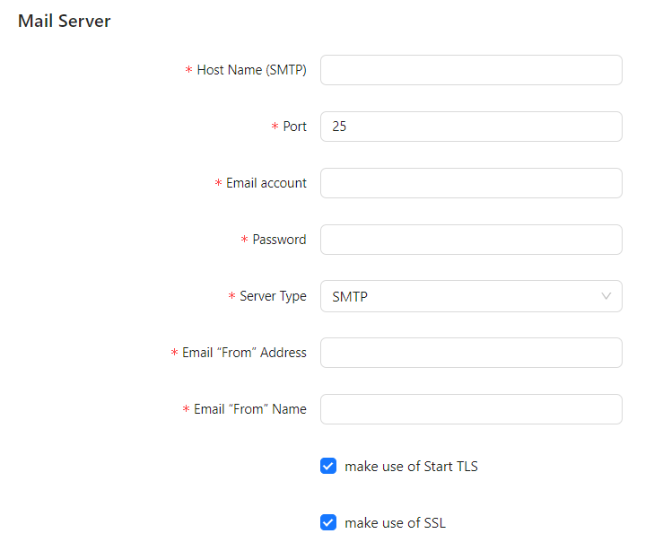

# Mail Server Configuration

Optimibi allows administrators to configure the mail server, enabling the system to send automated notification emails, such as **alert notifications** and **forgotten password emails**.

## 1. Accessing Mail Server Settings

1. **Log in to the Optimibi admin panel**.
2. In the left-hand menu navigation, click **“Settings”**.
3. Under **“Settings”**, select **“Mail Server”**.

## 2. Configuring the Mail Server

On the **Mail Server** configuration page, fill in the following SMTP server details:

### **Required Fields**

| Setting                  | Description                                                  |
| ------------------------ | ------------------------------------------------------------ |
| **Host Name (SMTP)**     | The SMTP server address, e.g., `smtp.163.com`.               |
| **Port**                 | The server port number. Common ports include:   - `25` (Unencrypted)   - `465` (SSL)   - `587` (TLS) |
| **Email Account**        | The email address used to send messages.                     |
| **Password**             | The SMTP login password for the email account (some providers may require an authorization code instead). |
| **Server Type**          | The type of mail server. Select `SMTP`.                      |
| **Email “From” Address** | The sender email address, usually the same as **Email Account**. |
| **Email “From” Name**    | The display name of the sender                               |

### **Optional Fields**

| Setting                    | Description                        |
|----------------------------|------------------------------------|
| **make use of Start TLS**  | Enables **TLS encryption** (recommended). |
| **make use of SSL**        | Enables **SSL encryption** (recommended). |

## 3. Testing the Mail Server Connection

After configuration, it is recommended to test the mail server connection to ensure emails can be sent successfully.

1. Click the **“Test Email Server”** button.
2. The system will attempt to send a test email to the address specified in **Email Account**.
3. If the test is successful, the mail server configuration is correct.
4. If the test fails, check whether the **SMTP server address, port, account, and password** are correct, and ensure the server is not blocked by a firewall.

## 4. Saving the Configuration

Once the configuration is verified, click the **“Save”** button to apply the mail server settings.

## 5. Common Issues and Solutions

| Issue                      | Possible Cause                  | Solution |
|----------------------------|---------------------------------|----------|
| **Test email failed to send** | Incorrect server information   | Verify that the **SMTP address, port, account, and password** are correct. |
| **Emails are blocked or not received** | Email provider security policies | Ensure the **SMTP account** allows third-party application access and try using an authorization code instead of a password. |
| **Incorrect port number**   | Some email providers restrict ports | Try using **25 / 465 / 587** or check the email provider’s documentation. |
| **SSL/TLS-related errors**  | Incompatible server security policies | Enable or disable **TLS/SSL** as required by the email provider. |

