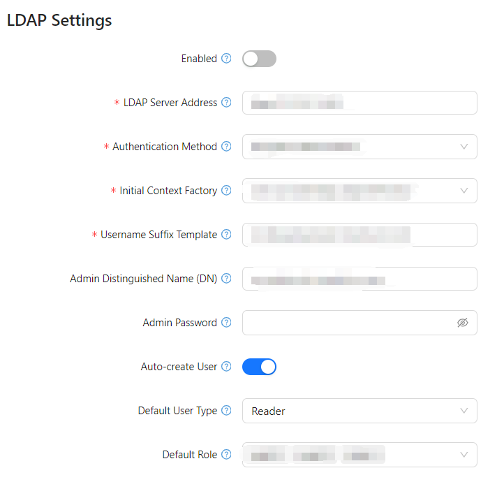

# **LDAP**

## **Overview**

LDAP (Lightweight Directory Access Protocol) integration in Optimibi allows administrators to authenticate users using an external LDAP server. This guide provides step-by-step instructions to configure and enable LDAP authentication within Optimibi.

------

## **1. Accessing LDAP Settings**

1. **Log in** to the Optimibi **admin panel**.

2. Navigate to **Settings** in the left-side menu.

3. Click on **LDAP** under the **System Settings** section.

------

## **2. LDAP Configuration Parameters**

The following fields must be properly configured to ensure successful LDAP authentication:

### **2.1 General Settings**

| Parameter                 | Description                                                  |
| ------------------------- | ------------------------------------------------------------ |
| **Enabled**               | Toggle to enable or disable LDAP authentication.             |
| **LDAP Server Address**   | The URL of the LDAP server, including the protocol (`ldap://` or `ldaps://`) and port (e.g., `ldap://127.0.0.1:389`). |
| **Authentication Method** | Select the authentication type: `Simple Authentication` or `Anonymous Authentication`. |

------

### **2.2 Connection Settings**

| Parameter                         | Description                                                  |
| --------------------------------- | ------------------------------------------------------------ |
| **Initial Context Factory**       | The fully qualified Java class for LDAP context initialization. Default: `com.sun.jndi.ldap.LdapCtxFactory`. |
| **Username Suffix Template**      | Template for generating user Distinguished Names (DN). Example: `cn=${username},dc=example,dc=com`. |
| **Admin Distinguished Name (DN)** | The DN of the administrator account used for LDAP authentication. Example: `cn=admin,dc=example,dc=com`. |
| **Admin Password**                | The password for the admin account to authenticate with the LDAP server. |

------

### **2.3 User Management Settings**

| Parameter             | Description                                                  |
| --------------------- | ------------------------------------------------------------ |
| **Auto-create User**  | If enabled, users will be automatically created in Optimibi if they do not exist in LDAP. |
| **Default User Type** | The default type assigned to new users (e.g., `Reader`).     |
| **Default Role**      | Default roles assigned to new users created through LDAP. Multiple roles can be assigned (e.g., `role2`, `role4`, `role5`). |

------

## **3. Configuring LDAP Authentication**

### **Step 1: Enable LDAP Authentication**

- Toggle **Enabled** to activate LDAP authentication.

### **Step 2: Configure Server and Authentication Settings**

- Enter the **LDAP Server Address** (e.g., `ldap://127.0.0.1:389`).
- Choose the **Authentication Method** (`Simple` or `Anonymous`).
- Specify the **Initial Context Factory** (`com.sun.jndi.ldap.LdapCtxFactory`).

### **Step 3: Set Up Admin Credentials**

- Define the **Admin DN** (`cn=admin,dc=example,dc=com`).
- Provide the **Admin Password**.

### **Step 4: Configure User Mapping**

- Define the **Username Suffix Template** (`cn=${username},dc=example,dc=com`).
- Enable **Auto-create User** if users should be automatically created in Optimibi.
- Select the **Default User Type** (`Reader`, `Editor`, etc.).
- Assign **Default Roles** (`role2`, `role4`, `role5`).

------

## **4. Saving and Validating Configuration**

1. Click **Save** to apply the LDAP settings.

2. Click 

   Validate

    to test the connection.

   - If successful: *Validation Successful* message appears.
   - If failed: Check LDAP credentials, server accessibility, or firewall settings.

------

## **5. Common Issues and Solutions**

| Issue                                | Possible Cause                       | Solution                                                     |
| ------------------------------------ | ------------------------------------ | ------------------------------------------------------------ |
| **Failed to connect to LDAP server** | Incorrect server address or port     | Verify the **LDAP Server Address** and ensure the server is reachable. |
| **Authentication failed**            | Incorrect admin credentials          | Check **Admin DN** and **Admin Password**.                   |
| **User login fails**                 | Username mapping is incorrect        | Review **Username Suffix Template** and adjust accordingly.  |
| **Auto-create user does not work**   | Auto-create feature is disabled      | Ensure **Auto-create User** is enabled.                      |
| **Roles are not assigned properly**  | Incorrect default role configuration | Verify **Default Role** settings and ensure correct role names are used. |

------

## **Conclusion**

By correctly configuring LDAP integration, Optimibi can securely authenticate users from an external directory, reducing the need for manual user management. Ensure all parameters are set correctly, and use the validation feature to test the connection before applying changes.