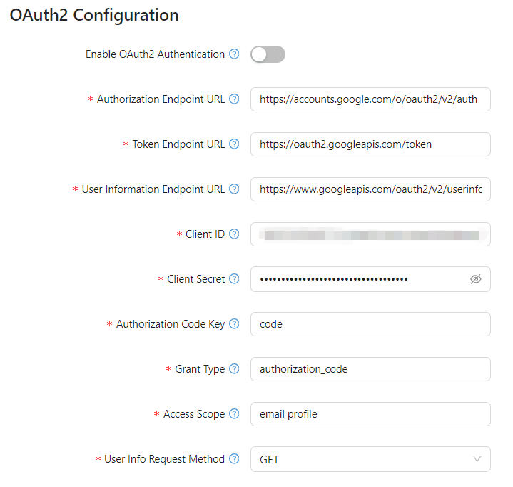

## **Overview**

OAuth2 authentication allows users to securely log in to Optimibi using third-party identity providers (e.g., **Google, Microsoft, GitHub**). This guide explains how to configure OAuth2 authentication in Optimibi, enabling **single sign-on (SSO)** functionality.

------

## **1. Accessing OAuth2 Configuration**

1. **Log in** to the **Optimibi** admin panel.

2. Navigate to **Settings** from the left-side menu.

3. Click on **OAuth2** under **System Settings**.

------

## **2. OAuth2 Configuration Parameters**

The following fields must be configured to enable OAuth2 authentication:

### **2.1 General Settings**

| Parameter                        | Description                                                  |
| -------------------------------- | ------------------------------------------------------------ |
| **Enable OAuth2 Authentication** | Toggle this option to enable or disable OAuth2 authentication in Optimibi. |

------

### **2.2 OAuth2 Endpoints**

| Parameter                         | Description                                                  |
| --------------------------------- | ------------------------------------------------------------ |
| **Authorization Endpoint URL**    | The OAuth2 authorization endpoint URL, used to initiate the authentication process. Example: `https://accounts.google.com/o/oauth2/v2/auth`. |
| **Token Endpoint URL**            | The URL used to exchange the authorization code for an access token. Example: `https://oauth2.googleapis.com/token`. |
| **User Information Endpoint URL** | The URL used to fetch user details after authentication. Example: `https://www.googleapis.com/oauth2/v2/userinfo`. |

------

### **2.3 Client Credentials**

| Parameter         | Description                                                  |
| ----------------- | ------------------------------------------------------------ |
| **Client ID**     | The unique identifier assigned to your application by the OAuth2 provider. |
| **Client Secret** | A confidential key paired with the Client ID, used for secure authentication. |

------

### **2.4 Authorization & Token Exchange**

| Parameter                  | Description                                                  |
| -------------------------- | ------------------------------------------------------------ |
| **Authorization Code Key** | The parameter name for the authorization code returned by the OAuth2 provider. Default: `code`. |
| **Grant Type**             | The OAuth2 authorization grant type. Example: `authorization_code`. |

------

### **2.5 User Information Retrieval**

| Parameter                    | Description                                                  |
| ---------------------------- | ------------------------------------------------------------ |
| **Access Scope**             | The OAuth2 scopes specifying which user data should be accessed. Example: `email profile`. |
| **User Info Request Method** | The HTTP method used to request user information (`GET` or `POST`). |

------

### **2.6 User Account Initialization**

| Parameter             | Description                                                  |
| --------------------- | ------------------------------------------------------------ |
| **Auto-create User**  | If enabled, Optimibi will automatically create user accounts upon first login. |
| **Default User Type** | The default type assigned to newly created users (e.g., `Reader`). |
| **Default Role**      | The default roles assigned to new users created via OAuth2 authentication. |

------

## **3. Configuring OAuth2 Authentication**

### **Step 1: Enable OAuth2 Authentication**

- Toggle **Enable OAuth2 Authentication** to activate the feature.

### **Step 2: Configure OAuth2 Endpoints**

- Enter the **Authorization Endpoint URL** (e.g., `https://accounts.google.com/o/oauth2/v2/auth`).
- Enter the **Token Endpoint URL** (e.g., `https://oauth2.googleapis.com/token`).
- Enter the **User Information Endpoint URL** (e.g., `https://www.googleapis.com/oauth2/v2/userinfo`).

### **Step 3: Provide Client Credentials**

- Enter the **Client ID** and **Client Secret** provided by your OAuth2 provider.

### **Step 4: Configure Authentication and Token Handling**

- Set **Authorization Code Key** to `code`.
- Set **Grant Type** to `authorization_code`.

### **Step 5: Configure User Information Handling**

- Define **Access Scope** (e.g., `email profile`).
- Select **User Info Request Method** (`GET` or `POST`).

### **Step 6: Configure User Account Management**

- Enable **Auto-create User** if you want accounts to be created automatically.
- Assign **Default User Type** (`Reader`, `Editor`, etc.).
- Define **Default Roles** (e.g., `role2`, `role4`, `role5`).

------

## **4. Saving and Testing Configuration**

1. Click **Save** to apply the OAuth2 settings.
2. Perform a test login using OAuth2.
   - If successful: The authentication flow should redirect to the Optimibi dashboard.
   - If failed: Check the **OAuth2 endpoint URLs, Client ID, Client Secret, and grant type**.

------

## **5. Common Issues and Solutions**

| Issue                              | Possible Cause                  | Solution                                                     |
| ---------------------------------- | ------------------------------- | ------------------------------------------------------------ |
| **Authentication fails**           | Incorrect OAuth2 credentials    | Verify **Client ID** and **Client Secret**.                  |
| **Redirect URI mismatch**          | Misconfigured redirect settings | Ensure the redirect URI is correctly set in the OAuth2 provider settings. |
| **Invalid authorization code**     | Expired or incorrect code       | Ensure the **Authorization Code Key** is set correctly.      |
| **User not created automatically** | Auto-create user disabled       | Enable **Auto-create User** in settings.                     |
| **Access denied**                  | Insufficient permissions        | Check the **Access Scope** settings.                         |

------

## **Conclusion**

By properly configuring OAuth2 authentication, Optimibi allows users to sign in securely using external identity providers. Ensure all parameters are correctly set and perform test logins before deploying OAuth2 authentication to end users.