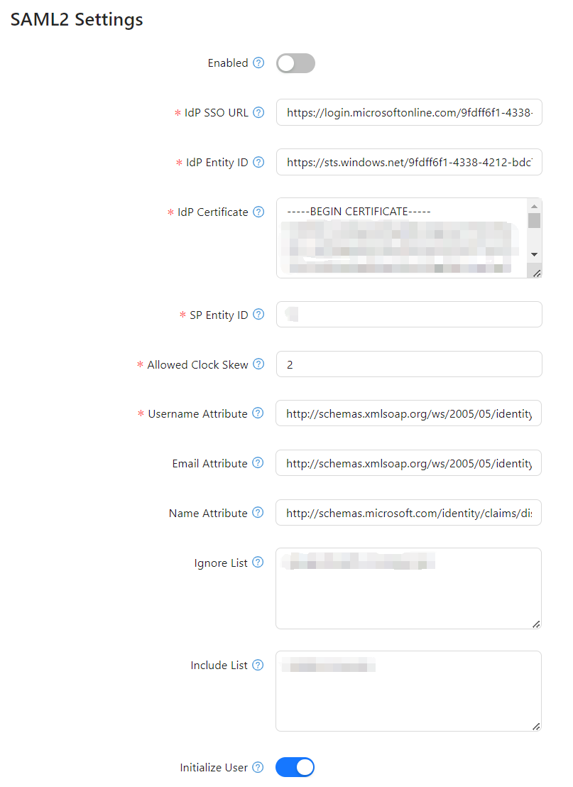

## **Overview**

SAML2 (Security Assertion Markup Language 2.0) enables **single sign-on (SSO)** authentication, allowing users to log into **Optimibi** using an **Identity Provider (IdP)** such as **Microsoft Azure AD, Okta, or other SAML2-supported providers**.

This guide provides step-by-step instructions to configure SAML2 authentication within Optimibi.

------

## **1. Accessing SAML2 Configuration**

1. **Log in** to the **Optimibi** admin panel.
2. Navigate to **Settings** from the left-side menu.
3. Click on **SAML2** under **System Settings**.

------

## **2. SAML2 Configuration Parameters**

The following fields must be configured to enable SAML2 authentication:

### **2.1 General Settings**

| Parameter   | Description                                                  |
| ----------- | ------------------------------------------------------------ |
| **Enabled** | Toggle this option to enable or disable SAML2 authentication in Optimibi. |

------

### **2.2 Identity Provider (IdP) Settings**

| Parameter           | Description                                                  |
| ------------------- | ------------------------------------------------------------ |
| **IdP SSO URL**     | The Single Sign-On (SSO) URL provided by the IdP. Example: `https://login.microsoftonline.com/9fdff6f1-4338...`. |
| **IdP Entity ID**   | The unique identifier (Entity ID) of the IdP. Example: `https://sts.windows.net/9fdff6f1-4338...`. |
| **IdP Certificate** | The X.509 certificate issued by the IdP to verify SAML responses. Ensure it includes `-----BEGIN CERTIFICATE-----` and `-----END CERTIFICATE-----`. |

------

### **2.3 Service Provider (SP) Settings**

| Parameter        | Description                                                  |
| ---------------- | ------------------------------------------------------------ |
| **SP Entity ID** | The unique identifier (Entity ID) of the Service Provider (SP). Example: `bi`. |

------

### **2.4 Authentication Handling**

| Parameter              | Description                                                  |
| ---------------------- | ------------------------------------------------------------ |
| **Allowed Clock Skew** | Defines the allowable time difference (in minutes) between the SP and IdP to account for clock drift. Example: `2`. |
| **Username Attribute** | The attribute in the SAML2 assertion that provides the username. Example: `http://schemas.xmlsoap.org/ws/2005/05/identity/claims/name`. |
| **Email Attribute**    | The attribute in the SAML2 assertion that provides the user's email address. Example: `http://schemas.xmlsoap.org/ws/2005/05/identity/claims/emailaddress`. |
| **Name Attribute**     | The attribute in the SAML2 assertion that provides the user's full name. Example: `http://schemas.microsoft.com/identity/claims/displayname`. |

------

### **2.5 Access Control**

| Parameter        | Description                                                  |
| ---------------- | ------------------------------------------------------------ |
| **Ignore List**  | A list of URLs that do not require SAML2 authentication. Multiple URLs should be separated by commas. |
| **Include List** | A list of URLs that require SAML2 authentication. Multiple URLs should be separated by commas. |

------

### **2.6 User Initialization Settings**

| Parameter                    | Description                                                  |
| ---------------------------- | ------------------------------------------------------------ |
| **Initialize User**          | If enabled, new users will be automatically created in Optimibi upon first login. |
| **Initialization User Type** | Defines the default user type assigned to new users. Example: `Reader`. |
| **Initialization Role**      | Specifies the default roles assigned to new users.           |

------

## **3. Configuring SAML2 Authentication**

### **Step 1: Enable SAML2 Authentication**

- Toggle **Enabled** to activate SAML2 authentication.

### **Step 2: Configure IdP Settings**

- Enter the **IdP SSO URL** (e.g., `https://login.microsoftonline.com/...`).
- Enter the **IdP Entity ID** (e.g., `https://sts.windows.net/...`).
- Copy and paste the **IdP Certificate** (Ensure it includes `-----BEGIN CERTIFICATE-----` and `-----END CERTIFICATE-----`).

### **Step 3: Configure SP Settings**

- Enter the **SP Entity ID** (e.g., `bi`).

### **Step 4: Set Authentication Handling Rules**

- Define the **Allowed Clock Skew** (e.g., `2` minutes).
- Specify the **Username Attribute**, **Email Attribute**, and **Name Attribute** based on IdP metadata.

### **Step 5: Configure Access Control**

- Add URLs to the **Ignore List** (URLs that bypass SAML2 authentication).
- Add URLs to the **Include List** (URLs that enforce SAML2 authentication).

### **Step 6: Set User Initialization Preferences**

- Enable **Initialize User** for automatic user creation.
- Define the **Initialization User Type** (e.g., `Reader`).
- Assign **Initialization Roles** to newly created users.

------

## **4. Saving and Testing Configuration**

1. Click **Save** to apply the SAML2 settings.
2. Perform a test login using SAML2.
   - If successful: The authentication flow should redirect to the Optimibi dashboard.
   - If failed: Check the **IdP settings, SP Entity ID, and attribute mappings**.

------

## **5. Common Issues and Solutions**

| Issue                              | Possible Cause                      | Solution                                                     |
| ---------------------------------- | ----------------------------------- | ------------------------------------------------------------ |
| **SAML2 authentication fails**     | Incorrect IdP settings              | Verify **IdP SSO URL**, **IdP Entity ID**, and **IdP Certificate**. |
| **User attribute mismatch**        | Incorrect attribute mapping         | Ensure the correct **Username, Email, and Name Attributes** are configured. |
| **Clock skew issues**              | Time differences between SP and IdP | Increase the **Allowed Clock Skew** value.                   |
| **User not created automatically** | Auto-create user disabled           | Enable **Initialize User** in settings.                      |

------

## **Conclusion**

By correctly configuring SAML2 authentication, **Optimibi** can integrate with external identity providers, allowing seamless **SSO login** for users. Ensure all parameters are correctly set and perform test logins before deploying SAML2 authentication to end users.