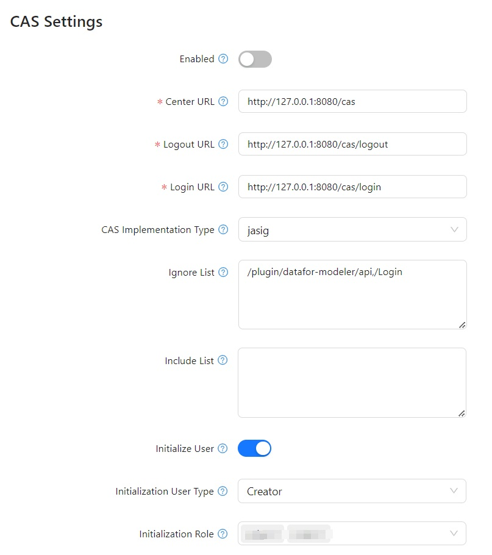

## **Overview**

CAS (Central Authentication Service) enables **single sign-on (SSO)** authentication, allowing users to log into **Optimibi** using a central authentication system. This guide provides step-by-step instructions for configuring CAS authentication in Optimibi.

------

## **1. Accessing CAS Configuration**

1. **Log in** to the **Optimibi** admin panel.
2. Navigate to **Settings** from the left-side menu.
3. Click on **CAS** under **System Settings**.

------

## **2. CAS Configuration Parameters**

The following fields must be configured to enable CAS authentication:

### **2.1 General Settings**

| Parameter   | Description                                                  |
| ----------- | ------------------------------------------------------------ |
| **Enabled** | Toggle this option to enable or disable CAS authentication in Optimibi. |

------

### **2.2 CAS Server Configuration**

| Parameter                   | Description                                                  |
| --------------------------- | ------------------------------------------------------------ |
| **Center URL**              | The main entry point of the CAS server. Example: `http://127.0.0.1:8080/cas`. |
| **Login URL**               | The CAS login service URL, used to redirect unauthenticated users. Example: `http://127.0.0.1:8080/cas/login`. |
| **Logout URL**              | The CAS logout service URL, used to sign out users. Example: `http://127.0.0.1:8080/cas/logout`. |
| **CAS Implementation Type** | Defines the CAS implementation type, such as `jasig` or another CAS-compatible protocol. |

------

### **2.3 Access Control**

| Parameter        | Description                                                  |
| ---------------- | ------------------------------------------------------------ |
| **Ignore List**  | A list of URLs that do not require CAS authentication. Multiple URLs should be separated by commas or new lines. |
| **Include List** | A list of URLs that require CAS authentication. Multiple URLs should be separated by commas or new lines. |

------

### **2.4 User Initialization Settings**

| Parameter                    | Description                                                  |
| ---------------------------- | ------------------------------------------------------------ |
| **Initialize User**          | If enabled, new users will be automatically created in Optimibi upon first login. |
| **Initialization User Type** | Defines the default user type assigned to new users. Example: `Creator`. |
| **Initialization Role**      | Specifies the default roles assigned to new users.           |

------

## **3. Configuring CAS Authentication**

### **Step 1: Enable CAS Authentication**

- Toggle **Enabled** to activate CAS authentication.

### **Step 2: Configure CAS Server Settings**

- Enter the **Center URL** (e.g., `http://127.0.0.1:8080/cas`).
- Enter the **Login URL** (e.g., `http://127.0.0.1:8080/cas/login`).
- Enter the **Logout URL** (e.g., `http://127.0.0.1:8080/cas/logout`).
- Select **CAS Implementation Type** (e.g., `jasig`).

### **Step 3: Set Access Control Rules**

- Add URLs to the **Ignore List** (URLs that bypass CAS authentication).
- Add URLs to the **Include List** (URLs that enforce CAS authentication).

### **Step 4: Configure User Initialization Preferences**

- Enable **Initialize User** for automatic user creation.
- Define the **Initialization User Type** (e.g., `Creator`).
- Assign **Initialization Roles** to newly created users.

------

## **4. Saving and Testing Configuration**

1. Click **Save** to apply the CAS settings.
2. Perform a test login using CAS.
   - If successful: The authentication flow should redirect to the Optimibi dashboard.
   - If failed: Check the **CAS server settings, login URL, and CAS implementation type**.

------

## **5. Common Issues and Solutions**

| Issue                              | Possible Cause               | Solution                                                     |
| ---------------------------------- | ---------------------------- | ------------------------------------------------------------ |
| **CAS authentication fails**       | Incorrect CAS settings       | Verify **Center URL**, **Login URL**, and **Logout URL**.    |
| **User not created automatically** | Auto-create user disabled    | Enable **Initialize User** in settings.                      |
| **CAS login loop**                 | CAS session misconfiguration | Ensure the CAS session settings are correctly configured in the CAS server. |

------

## **Conclusion**

By correctly configuring CAS authentication, **Optimibi** can integrate with a central authentication system, allowing seamless **SSO login** for users. Ensure all parameters are correctly set and perform test logins before deploying CAS authentication to end users.