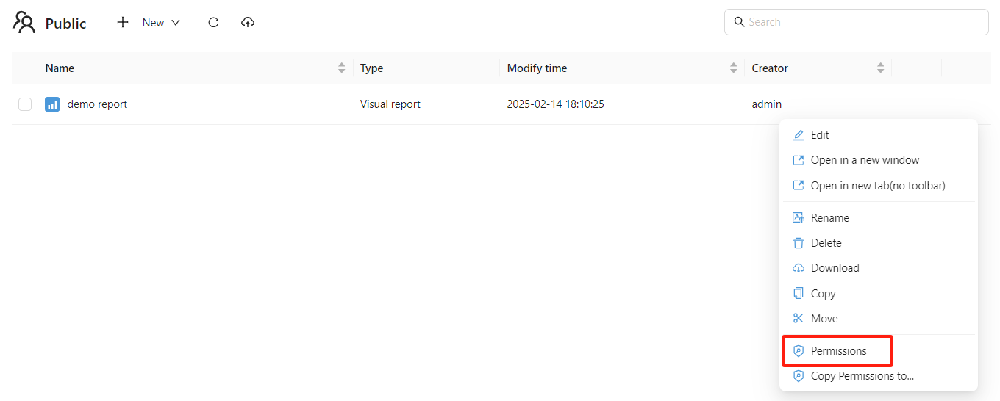
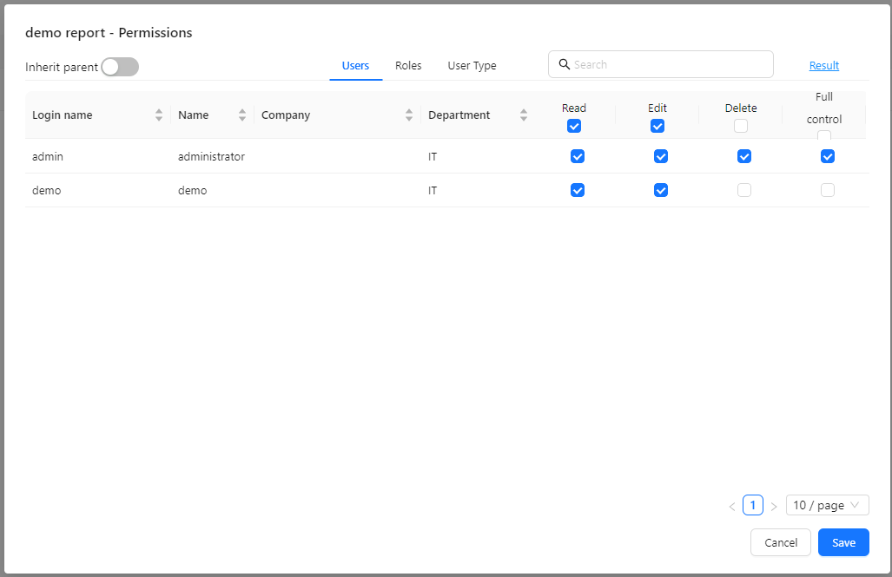
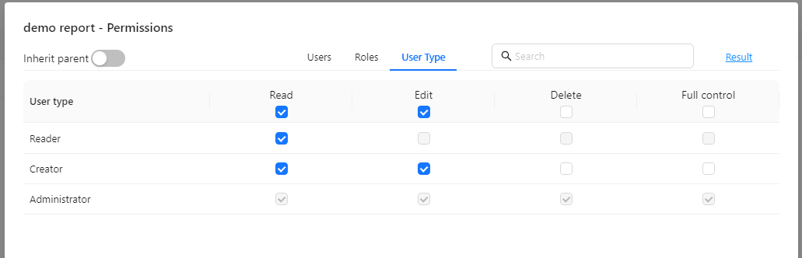
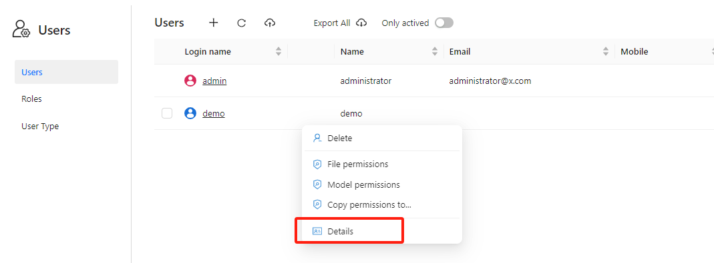
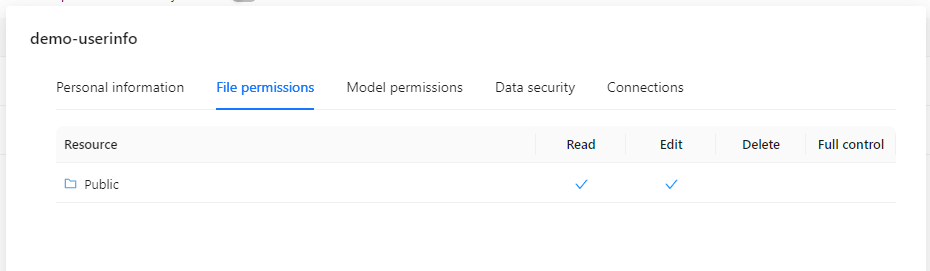

# Access Control List

**ACL (Access Control List)** is a crucial feature in Optimibi that enables fine-grained control over user access to reports, data sources, models, and folders. With ACL, you can ensure resource security and restrict access based on user roles and permissions.

## 1. What is ACL?

ACL is a permission control mechanism used to define access rights for resources. In Optimibi, resources include data sources, models, report files, and folders. ACL allows administrators to set permissions for these resources. The available permission levels are:

- **View**: The user can view the resource content.
- **Edit**: The user can modify the resource.
- **Delete**: The user can delete the resource.
- **Full Control**: Grants the user complete control over the resource, including the ability to manage permissions for other users or roles.

## 2. User and Role Authorization

ACL allows you to grant specific resource access to **users** and **roles**.

- **Users**: Individual users who can be assigned different roles and permissions.
- **Roles**: A collection of permissions assigned to a group of users. Managing permissions through roles simplifies access control.

### 2.1 Assigning Permissions

Permissions must be explicitly granted to users, roles, or user types for each resource (such as reports, data sources, or models). Follow these steps to assign permissions:

1. Navigate to the **Manage** page of the resource.

   

2. Locate the resource management menu and click **“Permissions”** to open the permission settings interface.

   

3. Select the user, role, or user type to grant permissions, and assign **View**, **Edit**, **Delete**, or **Full Control** rights.

   

4. Save the changes.

### 2.2 User-Type-Based Authorization

Optimibi provides three user types:

- **Read-Only Users**: Can only view resources but cannot modify or delete them.
- **Creator Users**: Can edit and create reports, data models, and other resources.
- **Administrators**: Have full control over all resources, including permission management.

ACL can also grant access based on user types. For example, administrators may have full control over all resources, while read-only users can only view them.

## 3. Folder and Report Authorization

Folder and report authorization in Optimibi has certain restrictions:

- **Private Folders**: Reports and folders within private directories cannot be shared with other users or roles.
- **Public Folders**: Only reports and subfolders in public folders can be authorized for access by other users or roles.

## 4. Permission Inheritance

Reports and subfolders can inherit permissions from their parent folder. This means that if permissions are assigned to a parent folder, all resources within that folder (such as reports and subfolders) will automatically inherit those permissions unless explicitly overridden.

## 5. Viewing Permissions

In the **User and Role Management** interface, you can click **"Details"** to view all resources assigned to a specific user or role. These resources may include data sources, models, reports, and folders.

On the **"Details"** page, you can see which resources the user or role has access to and their specific permissions (View, Edit, Delete, etc.).

## 6 Modifying Permissions

You can update permissions anytime through the **Permissions** management interface. This allows you to add, remove, or adjust permissions for users and roles as business requirements evolve.
