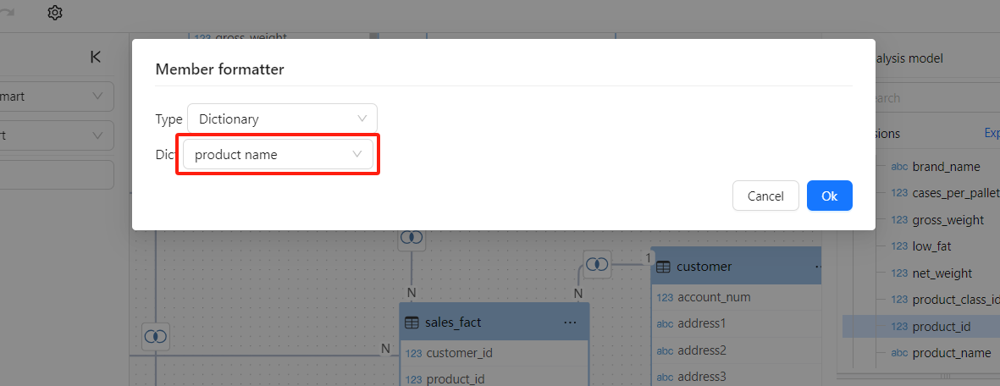

# Data Dictionary

## What is a Data Dictionary?

A **Data Dictionary** in OptimiBI is a data mapping table composed of key-value pairs:

- **Key**: Used to associate with other data fields.
- **Value**: Used to replace the original field values within the analysis model.

Using a data dictionary allows you to manage data display content flexibly and consistently.

## When to Use a Data Dictionary

Sometimes you may want to display meaningful descriptions instead of raw values or codes stored in your database. There are two ways to achieve this:

- **Method 1: Direct Caption Field**
  - If the display value exists within your current data table, directly set it as the Caption Field for the dimension.
- **Method 2: Using a Data Dictionary** (Recommended in the following scenarios):
  - The corresponding display field is missing in the database.
  - The display field is located in another table or data source.

## Creating a Data Dictionary

Follow these steps to create a data dictionary:

1. Navigate to the **Tools > Dictionary** page.
2. Click the **New Data Dictionary** button.

   

3. Enter a name for the data dictionary, select the **Datasource**, and write the required SQL query.

   The first column returned by the SQL query is considered the **Key**, and the second column is the corresponding **Value**.

   

4. Click **Save** to complete the creation.

## **How to Apply a Data Dictionary**

The data dictionary is used to replace original values of dimension fields within analysis models.

### Assigning a Data Dictionary in Analysis Models

1. Open your analysis model in the OptimiBI console.

2. Select the dimension field that requires a data dictionary.

3. In the **Attributes** panel on the right side, click on **Member Formatter**.

   

4. Choose the data dictionary you created earlier from the available options.

   

5. Save and publish your analysis model.

### Viewing Data Dictionary Results in Reports

Fields linked to a data dictionary will display the corresponding dictionary values in your reports.

## Summary

The data dictionary is a powerful feature in OptimiBI, allowing you to define and unify display values flexibly, especially useful when the database structure is incomplete or when consolidating display fields across multiple tables or data sources. By following the steps above, you can effectively create, manage, and optimize the data display using data dictionaries.