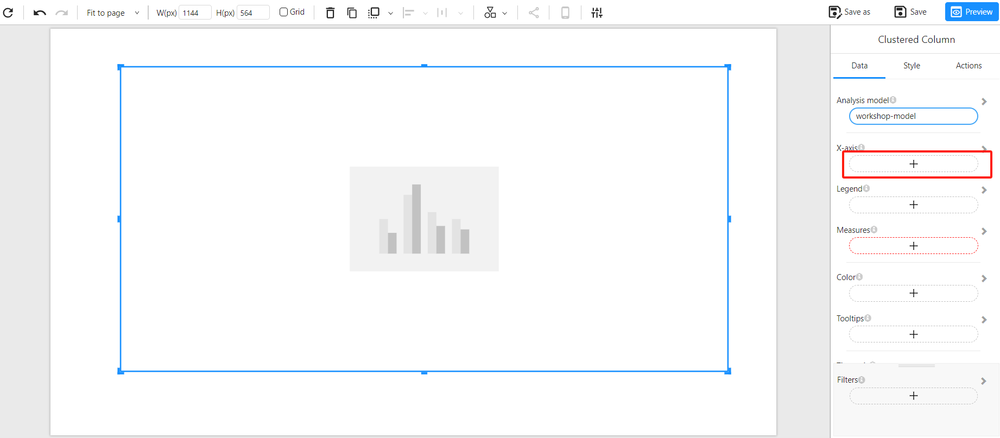
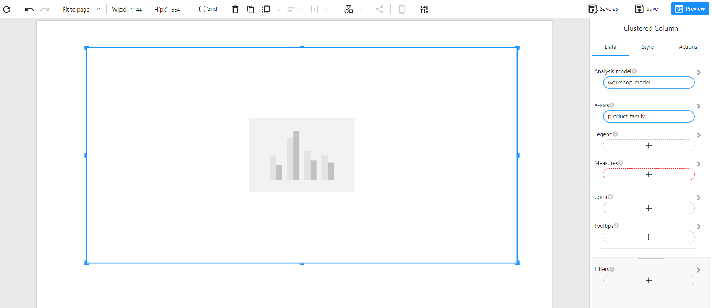
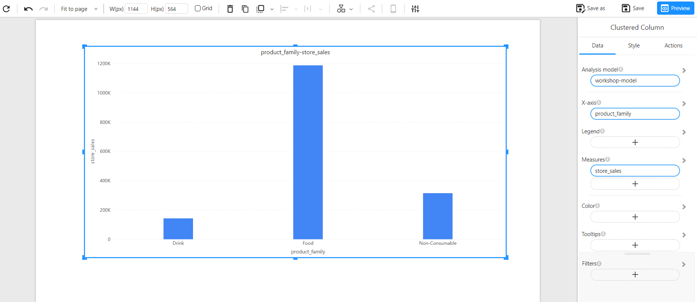

# Adding Charts

## Detailed Steps to Add a Chart

### Open the Visualization Pane

- Click on the canvas in the editing page. On the right-hand side, locate the **"Components"** panel, where various chart icons are displayed.

  

### Select and Add a Chart

- Choose the appropriate chart type based on your data visualization needs (e.g., bar chart, line chart, pie chart, scatter plot, etc.).
- Click on the desired chart icon, then click on the report canvas or drag and drop it to create a blank chart placeholder.

  

### Configure Chart Fields

- Click on the **"Data"** panel on the right and select **"Analysis Model"** to link an analytical model to the chart.

  

- Select the desired analysis model.

  

- Click the **"Back"** button to return to the data panel.

  

- Add the **"X-axis"** field for the bar chart.

  

- Select the desired field.

  

- Click **"Back"** again to return to the data panel.

  

- Similarly, add the **"Measure"** field just like the X-axis field.

  

### Customize Chart Style and Formatting

- Select the chart and click on the **"Style"** panel on the right to open the styling options.

  

- Adjust the following settings as needed:
  - **Title & Labels**: Configure the chart title, font, color, and size. Adjust axis labels' display settings.
  - **Background & Borders**: Modify the background color, border styles, and shadow effects to align with the report's overall theme.
  - **Data Labels**: Enable and format data labels to improve readability and provide better insights.

  

### Adjust Chart Layout

- Resize and reposition the chart on the report canvas by dragging its borders to ensure optimal visibility.

  

- Use alignment tools, gridlines, and distribution options to ensure that multiple charts are properly aligned, enhancing the report's readability and visual appeal.
