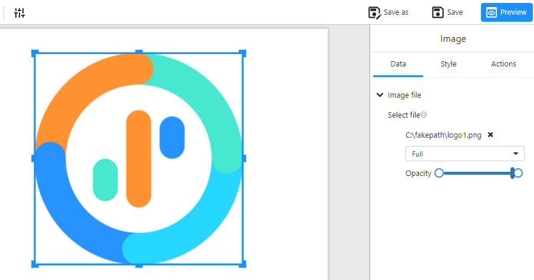

# **Image**

## **Overview**

The **Image** component allows users to display images in reports or dashboards. It supports uploading local image files and provides styling customization options such as borders, shadows, and rounded edges.

## **1. How to Add an Image**

1. Select the **Image** component.
2. In the right panel, click the **"Select file"** button.
3. Choose an image file from your computer.
4. Once uploaded, the image will appear in the component, filling the designated area by default.

## **2. Data Settings**

In the **“Data”** tab, you can configure the following settings:

- **Image file**: Upload or replace the image file.

- Display mode:

  - **Full** (default): The image fully fills the component area.
  - **Fit**: Maintains the original aspect ratio while fitting within the component.
  
- **Opacity**: Adjust the image transparency using a slider.

## **3. Style Settings**

In the **“Style”** tab, you can customize the image’s appearance:

### **3.1 Border Settings**

- **Border style**: Modify the border width, color, and style (solid, dashed, etc.).
- **Shadow**: Enable or disable shadow effects around the image.
- **Round edges**: Adjust the border radius to make the corners rounded.

### **3.2 Image Description**

- **Content**: Add a text description for the image.
- **Font**: Customize the text font, size, color, bold, and italic styles.
- **Y offset**: Adjust the vertical position of the description text.

## **4. Actions**

- **Click actions**: Set an action when the image is clicked, such as navigating to a URL.

## **5. Important Notes**

- Ensure the image size is optimized for clarity in reports.
- Large image files may impact loading speed; consider compressing them if necessary.
- When using PNG images with transparency, adjust **Opacity** to achieve the desired visual effect.
