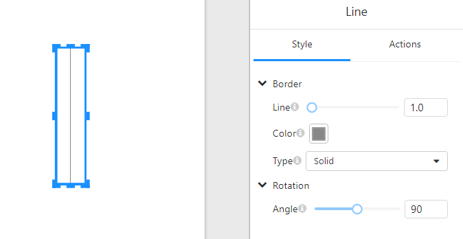

# **Line Component**

## **Overview**

The **Line Component** is used to draw straight lines within a page or report, helping to enhance visual separation, define areas, or highlight specific content. Users can customize the color, style, width, and rotation angle of the line to meet different design requirements.

### **Use Cases**

- **Content Separation**: Used to divide different data sections within a page or report.
- **Enhanced Visual Effects**: Acts as a decorative element to improve data presentation clarity.
- **Alignment Assistance**: Helps create a well-structured layout when combined with other components.

## **Configuration Parameters**

| Parameter            | Type         | Description                                               |
| -------------------- | ------------ | --------------------------------------------------------- |
| **Line (Width)**     | Numeric      | Sets the width of the line, default is `1.0`.             |
| **Color**            | Color Picker | Defines the line color.                                   |
| **Type**             | Dropdown     | Specifies the line style: `Solid`, `Dashed`, or `Dotted`. |
| **Angle (Rotation)** | Numeric      | Rotates the line within `0° - 360°`, default is `0°`.     |

## **Usage Guide**

### **1. Adding the Line Component**

Select the **Line Component** from the panel and drag it to the desired position on the page.

### **2. Configuring the Border Style**

In the **Style Panel**:

- Adjust **Line (Width)** to modify the thickness of the line.
- Choose **Color** to change the line's color.
- Use the **Type** dropdown to select between `Solid`, `Dashed`, or `Dotted` styles.

### **3. Rotating the Line**

In the **Rotation (Angle)** settings:

- Adjust the **Angle** slider to set the line's rotation.
- For example, `0°` represents a horizontal line, while `90°` creates a vertical line.