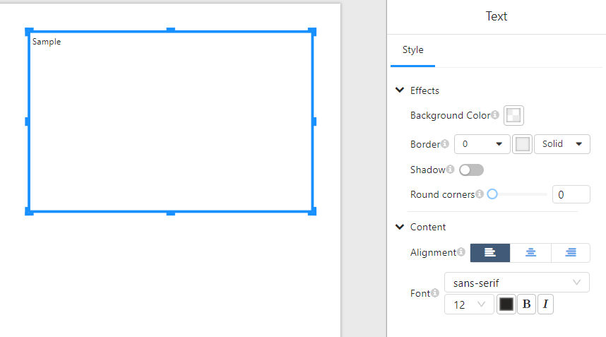

# **Text Component**

## **Overview**

The **Text Component** is used to display textual content within a page or report. It allows users to format, style, and align text according to their needs, making it an essential element for labeling, providing descriptions, or adding contextual information.

### **Use Cases**

- **Adding Titles and Labels**: Use text elements to create section headers and labels.
- **Providing Explanatory Content**: Include descriptions or additional details to complement visual elements.
- **Customizing Text Appearance**: Adjust fonts, colors, and alignment for better readability and aesthetics.

## **Configuration Parameters**

### **1. Effects**

| Parameter            | Description                                                  |
| -------------------- | ------------------------------------------------------------ |
| **Background Color** | Sets the background color of the text box.                   |
| **Border**           | Defines the border width and style (`Solid`, `Dashed`, `Dotted`). |
| **Shadow**           | Enables or disables a shadow effect around the text box.     |
| **Round Corners**    | Adjusts the corner radius for a softer appearance.           |

### **2. Content Formatting**

| Parameter      | Description                                     |
| -------------- | ----------------------------------------------- |
| **Alignment**  | Aligns text to the left, center, or right.      |
| **Font**       | Specifies the font family (e.g., `sans-serif`). |
| **Font Size**  | Adjusts the text size.                          |
| **Font Color** | Sets the color of the text.                     |
| **Bold (B)**   | Toggles bold formatting.                        |
| **Italic (I)** | Toggles italic formatting.                      |

## **Usage Guide**

### **1. Adding a Text Component**

- Select the **Text Component** from the panel and drag it to the desired location on the page.

### **2. Formatting Text**

- Modify the font, size, and color using the **Content** section in the **Style Panel**.
- Align the text using the left, center, or right alignment options.
- Apply **bold** or **italic** styles as needed.

### **3. Adjusting Background and Borders**

- Set a background color for the text box.
- Adjust the border width and select a style (`Solid`, `Dashed`, or `Dotted`).
- Enable shadow effects or round the corners for a softer look.
