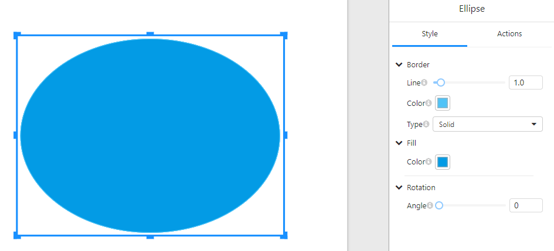

# **Ellipse**

## **Overview**

The **Ellipse** component allows users to add an oval shape to reports or dashboards. It supports customization options such as border settings, fill color, rotation, and event actions.

## **1. Style Settings**

In the **"Style"** tab, users can configure the visual properties of the ellipse:

### **1.1 Border Settings**

- **Line**: Adjust the border thickness using a slider or input field.
- **Color**: Select the border color.
- **Type**: Choose the border style, such as **solid**, **dashed**, or **dotted**.

### **1.2 Fill Settings**

- **Color**: Set the fill color of the ellipse.

### **1.3 Rotation**

- **Angle**: Rotate the ellipse by adjusting the angle value.

## **2. Actions Settings**

In the **"Actions"** tab, users can configure interactive behaviors for the ellipse:

### **2.1 Click Event**

- **Click event**: Define an action that occurs when the ellipse is clicked, such as navigating to a URL, triggering a function, or interacting with other components.

## **3. Usage Examples**

- **Decorative Elements**: Add ellipses to enhance the visual appeal of dashboards.
- **Interactive Buttons**: Assign click events to make the ellipse function as a button.
- **Data Highlighting**: Use different colors and border styles to emphasize specific areas.

## **4. Notes**

- Ensure that the border and fill colors contrast well for better visibility.
- When using the **click event**, make sure it aligns with the report's functionality.
- Rotating the ellipse may affect its alignment with other components.