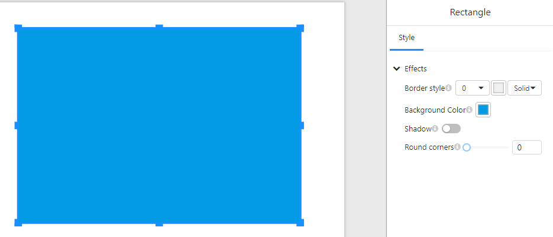

# **Rectangle**

## **Overview**

The **Rectangle** component allows users to add rectangular shapes to reports or dashboards. It supports various customization options such as border styling, background color, shadows, and rounded corners.

## **1. Style Settings**

In the **"Style"** tab, users can configure the appearance of the rectangle:

### **1.1 Border Settings**

- **Border style**: Adjust the border width using a numerical input.
- **Border type**: Select the style of the border (e.g., **solid**, **dashed**, **dotted**).
- **Border color**: Choose a color for the border.

### **1.2 Background Settings**

- **Background Color**: Set the fill color of the rectangle.

### **1.3 Shadow Effect**

- **Shadow**: Enable or disable a shadow effect around the rectangle.

### **1.4 Corner Rounding**

- **Round corners**: Adjust the corner radius to create rounded edges.

## **2. Usage Examples**

- **Background Elements**: Use rectangles as colored backgrounds for grouping or highlighting data.
- **Buttons**: Combine with click events (if supported) to create interactive buttons.
- **Decorative Elements**: Enhance the dashboard's appearance with different styles and colors.

## **3. Notes**

- Ensure a good contrast between the **background color** and other components for better visibility.
- Using **rounded corners** can make the rectangle look like a button or card element.
- When **shadows** are enabled, ensure they complement the design without affecting readability.

