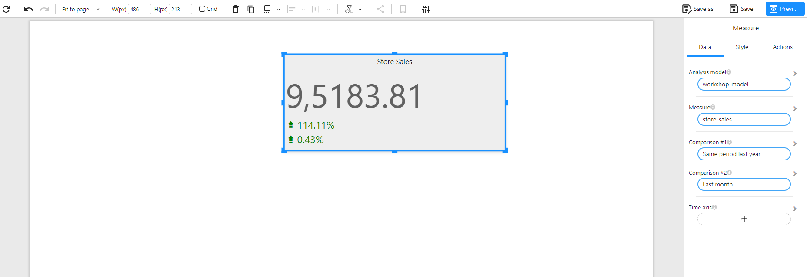

# Measure

## Overview

The **Measure** component is a numerical indicator card used to display a single aggregated value, often accompanied by comparisons to historical values (e.g., previous month, same period last year). It is frequently used for key metrics like sales, revenue, profit, or user count.

This component supports automatic trend indicators and color-coded comparisons, allowing users to quickly grasp **current performance** and **relative change**.

### When to Use

- To display **key metrics** in dashboards.
- To show **growth, variance**, or **percentage change** from a previous period.
- To compare current values with **historical benchmarks** (e.g., same month last year).
- To visualize a **summary value** alongside trend indicators.

## Data Structure

The **Measure** component requires the following configuration:

| Field          | Description                                                  |
| -------------- | ------------------------------------------------------------ |
| Analysis model | The data model to use.                                       |
| Measure        | The numerical field to aggregate (e.g., `store_sales`).      |
| Comparison #1  | Optional comparison period (e.g., "Same period last year").  |
| Comparison #2  | Optional second comparison (e.g., "Last month").             |
| Time axis      | The time dimension used to determine period-over-period comparisons. |

## Value Type (Comparison)

For each comparison (e.g., `Comparison #1`, `Comparison #2`), the value type determines how the delta is calculated and displayed.

| Value Type | Description                                                                 |
| ---------- | --------------------------------------------------------------------------- |
| Value      | Shows the current value (absolute value of the selected comparison period). |
| Change     | Shows the **difference** between the current value and the comparison value.|
| Growth%    | Shows the **percentage growth**, i.e., `(Current - Previous) / Previous`.   |

**Example**:

- **Current Value (store_sales)**: `9,5183.81`  
- **Comparison (Same period last year)**: `4,446.18`  
- **Growth%**: `((95183.81 - 4446.18) / 4446.18) ≈ 114.11%`

The component displays trend icons (e.g., ▲ / ▼) and color codes (green for positive growth, red for decline) based on this value.

## Example

This example shows the current store sales along with comparisons to the same period last year and last month, both in **Growth%** format:

## Style Configuration

The **Style** tab provides extensive formatting options for customizing the appearance of the Measure component. Below are the key configurable sections:

### 🔹 Title

| Option     | Description                                                  |
| ---------- | ------------------------------------------------------------ |
| Show       | Toggle title visibility.                                     |
| Content    | Text label displayed above the measure (e.g., "Store Sales"). |
| Alignment  | Align title: left / center / right.                          |
| Font       | Set font family, size, weight, color.                        |
| Background | Set title background color (optional).                       |

### 🔹 Effects

| Option           | Description                                              |
| ---------------- | -------------------------------------------------------- |
| Background Color | Set background color for the entire card.                |
| Border           | Customize border width, style (solid/dashed), and color. |
| Round Corners    | Apply border-radius (in px) for rounded corners.         |
| Shadow           | Toggle shadow effect to give a card-like feel.           |

### 🔹 Data Colors

Customize color rules dynamically based on values (used in conditional formatting).

### 🔹 Measure

| Option | Description                                      |
| ------ | ------------------------------------------------ |
| Font   | Set font for the main measure value.             |
| Align  | Align value horizontally: left / center / right. |

### 🔹 Comparison #1 / #2

These sections control how the comparison values are displayed.

| Option       | Description                                                                 |
| ------------ | --------------------------------------------------------------------------- |
| Show Name    | Whether to show the comparison label (e.g., "vs Last Month").               |
| Value Type   | How the comparison is calculated: • `Value` – absolute comparison value • `Change` – difference from baseline • `Growth%` – percentage change |
| Font / Align | Customize font style and alignment of the comparison value.                 |

### 🔹 Comparison Color

| Option                | Description                                         |
| --------------------- | --------------------------------------------------- |
| Positive Change Color | Set the color for positive growth (default: green). |
| Negative Change Color | Set the color for negative growth (default: red).   |
| Layout (Placement)    | Position of comparison values: • `Default` – below the value • `Right` – to the right of the value • `Bottom` – at the bottom of the component |

### 🔹 Layout

| Option  | Description                                                                 |
| ------- | --------------------------------------------------------------------------- |
| Default | Comparison values are placed **below** the main value (vertical layout).    |
| Right   | Comparison values appear **to the right** of the main value (horizontal layout). |
| Bottom  | Comparison values are shown at the **bottom** of the component (full-width footer layout). |

### 🔹 Toolbar

| Option        | Description                                                                 |
| ------------- | --------------------------------------------------------------------------- |
| Display Mode  | Toolbar visibility mode: • `Show on hover` (default) • `Hidden` • `Always visible` |
| Toolbar Color | Customize the background color of the toolbar.                              |
