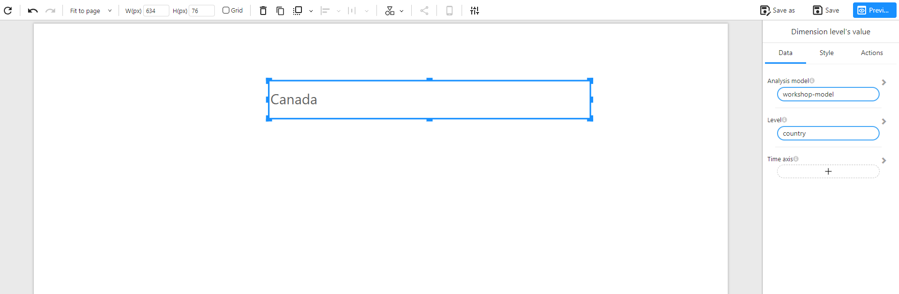

# Dimension Value

## Overview

The **Dimension Value** component is used to display a single **dimension-level value**, such as the name of a region, category, or user group. It simply outputs the first value in the current filter context and is typically used to **label a selection**, **highlight a filter**, or **add context to metrics** on a dashboard.

### When to Use

- To show the **currently selected dimension value**, such as country, store, or department.
- To create **dynamic titles or labels** based on filter context.
- To add **descriptive context** to KPIs, charts, or tables.

## Data Structure

The component uses the **first value** of the selected dimension field within the current filter scope.

| Field          | Description                                                  |
| -------------- | ------------------------------------------------------------ |
| Analysis model | The data model to query.                                     |
| Level          | The dimension field to display (e.g., `country`, `category`). |
| Time axis      | (Optional) Time context for future extension or dynamic behavior. |

> ℹ️ **Note**: Only the **first value** is returned based on current filter context. If multiple values exist, only the first one will be shown.

## Example

If the field `country` is selected and the filter context limits the data to `Canada`, then the component will simply display:

