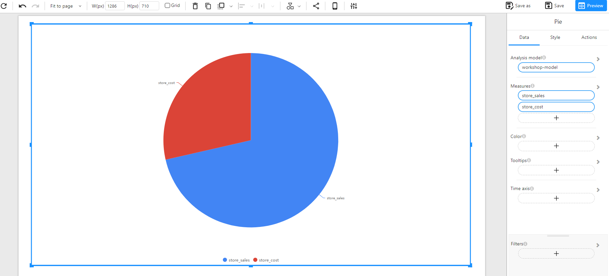

# Pie Chart

## Overview

A **Pie Chart** is used to represent proportions of a whole, displaying data as slices of a circle. Each slice corresponds to a category and its relative contribution to the total. This type of visualization is ideal for understanding distribution and comparison at a glance.

### When to Use

- To **show proportions** of a dataset where categories contribute to a whole.
- To **compare relative sizes** of groups without focusing on trends over time.
- To **simplify categorical data** into an easily interpretable format.

## Data Structure

A **Pie Chart** requires:

- **Legend**: A categorical field that defines different slices (e.g., Product Family, Department, Category).
- **Measures**: A numerical field representing the values that define the size of each slice (e.g., Sales, Revenue, Units Sold).
- **Filters (Optional)**: Used to refine the data displayed by the chart (e.g., filtering by month, region, or product type).

### Example Data Structure

| product_family | store_sales | store_cost |
| -------------- | ----------- | ---------- |
| Drink          | 4802.03     | 1925.31    |
| Food           | 41484.40    | 16562.05   |
| Non-Consumable | 10679.21    | 4258.77    |

## How to Configure

### Comparing a Single Measure

1. **Select the Analysis Model**: Choose the dataset containing the necessary fields.

2. **Set Legend**: Select the categorical field to define the pie slices (e.g., `product_family`).

3. **Set Measures**: Select a single numerical field representing values (e.g., `store_sales`).

4. **Optional Customization**:

   - **Color**: Assign custom colors to categories.
   - **Tooltips**: Show additional details when hovering over slices.
   - **Filters**: Restrict data using filters to refine the visualization.

   

### Comparing Multiple Measures

A **Pie Chart** can also compare multiple measures without a categorical legend. Instead of segmenting by a category, the pie slices represent different measures directly.

1. **Select the Analysis Model**: Choose the dataset containing the necessary fields.

2. **Set Measures**: Select multiple numerical fields to compare (e.g., `store_sales`, `store_cost`).

3. **Optional Customization**:

   - **Color**: Assign distinct colors to differentiate measures.
   - **Tooltips**: Display additional details when hovering over slices.
   - **Filters**: Apply filters to refine the dataset.
   
   

