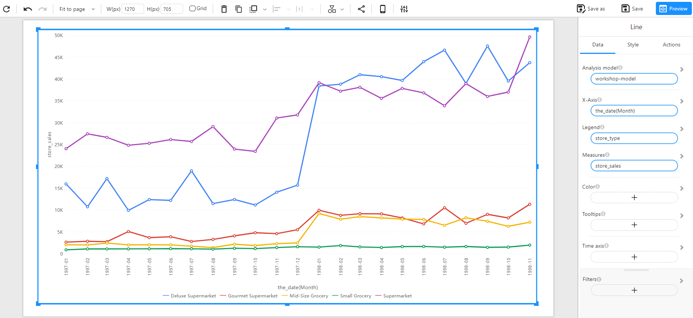

# Line Chart

## Overview

A **Line Chart** is used to visualize trends over time by connecting data points with lines. It is useful for showing changes, patterns, and relationships across different time periods.

### When to Use

- To **analyze trends** over time (e.g., sales over months).
- To **compare multiple series** of data over the same time period.
- To **detect seasonal patterns** or variations in data.

## Data Structure

A **Line Chart** requires:

- **X-Axis**: A time-based dimension (e.g., `the_date(Month)`).
- **Measures**: One or more numerical fields representing the trend data (e.g., `store_sales`, `store_invoice`, `store_cost`).
- **Legend (Optional)**: A categorical field that differentiates the lines (e.g., `store_type`).
- **Color(Optional):** Used to set the color of the chart based on categories or numerical values (intensity-based coloring, or using a categorical field for distinct colors).
- **Tooltips(Optional)**: Show additional details when hovering over plot area.
- **Filters (Optional)**: Used to refine the displayed data (e.g., filtering by region, product category).

## How to Configure

### Single Measure Line Chart

**Example Data Structure**

| the_date(Month) | store_type          | store_sales |
| --------------- | ------------------- | ----------- |
| 1998-11         | Supermarket         | 49606.44    |
| 1998-09         | Deluxe Supermarket  | 47535.31    |
| 1998-04         | Deluxe Supermarket  | 40525.14    |
| 1998-05         | Deluxe Supermarket  | 39642.43    |
| 1998-04         | Supermarket         | 35456.96    |
| 1998-07         | Supermarket         | 33860.21    |
| 1998-11         | Gourmet Supermarket | 11314.79    |
| 1998-01         | Gourmet Supermarket | 9928.90     |
| 1998-01         | Mid-Size Grocery    | 9188.15     |
| 1998-03         | Gourmet Supermarket | 9146.81     |

**Example**: The following example shows **store sales trends across different store types**.

### Multiple Measure Line Chart

**Example Data Structure**

| the_date(Month) | store_sales | store_invoice | store_cost |
| --------------- | ----------- | ------------- | ---------- |
| 1998-11         | 113787.84   | 15911.64      | 45669.87   |
| 1998-09         | 101378.60   | 15141.37      | 40612.14   |
| 1998-07         | 98943.44    | 14918.34      | 39754.67   |
| 1998-03         | 98219.90    | 13997.53      | 39368.83   |
| 1998-01         | 98155.28    | 15148.30      | 39239.18   |
| 1998-06         | 97050.04    | 15433.66      | 38995.82   |

**Example**: The following example visualizes **store sales, store invoice, and store cost over time**.

