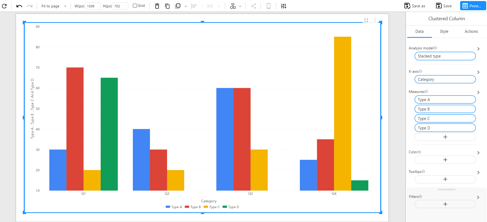
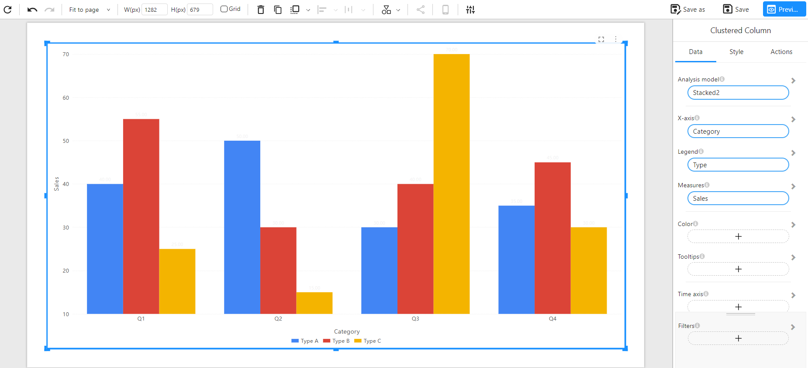

# Clustered Column Chart

## Overview

A **Clustered Column Chart** displays values for different sub-categories grouped (clustered) side-by-side within each main category along the X-axis. This type of chart is useful for comparing multiple series **within** and **across** categories.

Unlike stacked charts, clustered charts do not aggregate values into a single bar — instead, each series retains its own bar for direct comparison.

### When to Use

- To **compare multiple series** across a shared category.
- To highlight **relative performance** of sub-categories.
- To avoid stacking when **aggregated values are not meaningful**.
- When the goal is to **preserve series independence** visually.

## Data Structure

Clustered Column Charts support two data formats:

### **Method 1: Wide Table Format (Multiple Measures)**

Each sub-category (e.g., Type A, Type B...) is stored in its own column. Each row represents one main category (e.g., Q1, Q2...).

**Component Configuration**:
- **X-Axis**: Category
- **Measures**: Type A, Type B, Type C, Type D

**Example Data**:

| Category | Type A | Type B | Type C | Type D |
| -------- | ------ | ------ | ------ | ------ |
| Q1       | 30     | 70     | 20     | 65     |
| Q2       | 40     | 30     | 20     | 10     |
| Q3       | 60     | 60     | 30     | 10     |
| Q4       | 25     | 35     | 85     | 15     |

**Chart Example**:

### **Method 2: Long Table Format (Dimension + Measure)**

Each row represents a unique combination of main category and sub-category, with the corresponding measure value.

**Component Configuration**:
- **X-Axis**: Category
- **Legend**: Type
- **Measure**: Sales

**Example Data**:

| Category | Type   | Sales |
| -------- | ------ | ----- |
| Q1       | Type A | 40    |
| Q1       | Type B | 55    |
| Q1       | Type C | 25    |
| Q2       | Type A | 50    |
| Q2       | Type B | 30    |
| Q2       | Type C | 15    |
| Q3       | Type A | 30    |
| Q3       | Type B | 40    |
| Q3       | Type C | 70    |
| Q4       | Type A | 35    |
| Q4       | Type B | 45    |
| Q4       | Type C | 30    |

**Chart Example**:

## Notes

- Bars for each sub-category are rendered **side-by-side** within each main category group.
- Colors are used to differentiate sub-categories.
- Enables **direct comparison** between sub-categories without stacking.
- Supports tooltips, filters, and style customizations.