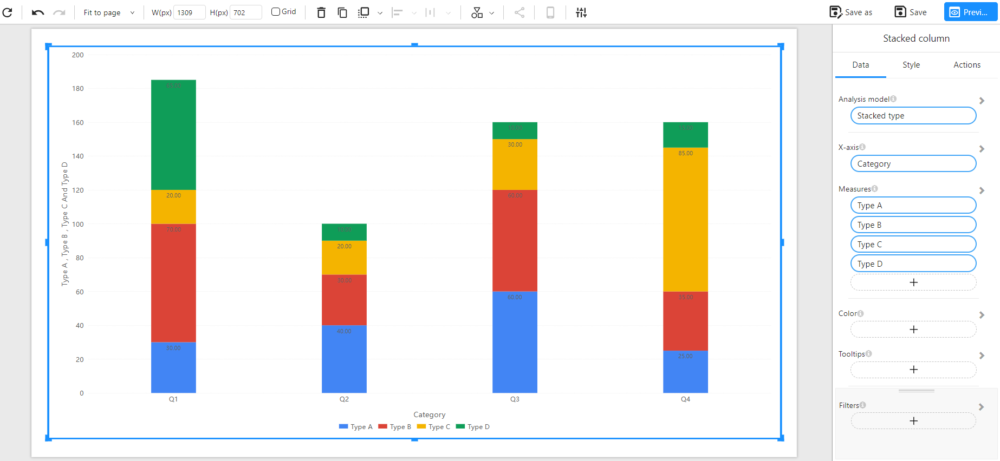
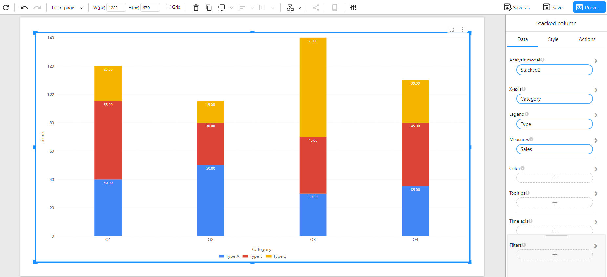

# Stacked Column Chart

## Overview

A **Stacked Column Chart** is a vertical bar chart where values of different series are stacked on top of one another. It allows you to compare both the total values across categories and the contribution of each sub-category within the total.

This chart is commonly used to track composition changes over time or across groups while also showing overall trends.

### When to Use

- To show both **part-to-whole relationships** and **total values**.
- To track how **components change** over time or across categories.
- When you want to **highlight totals and breakdowns** together.

---

## Data Structure

Stacked Column Charts support two data formats:

---

### **Method 1: Wide Table Format (Multiple Measures)**

Each measure (e.g., Type A, Type B...) is a separate column, and each row corresponds to a single category (e.g., Q1, Q2...).

**Component Configuration**:
- **X-Axis**: Category
- **Measures**: Type A, Type B, Type C, Type D

**Example Data**:

| Category | Type A | Type B | Type C | Type D |
| -------- | ------ | ------ | ------ | ------ |
| Q1       | 30     | 70     | 20     | 65     |
| Q2       | 40     | 30     | 20     | 10     |
| Q3       | 60     | 60     | 30     | 10     |
| Q4       | 25     | 35     | 85     | 15     |

**Chart Example**:

---

### **Method 2: Long Table Format (Dimension + Measure)**

Each row represents a single data point, with a category, sub-category (e.g., Type), and a value.

**Component Configuration**:
- **X-Axis**: Category
- **Legend**: Type
- **Measures**: Sales

**Example Data**:

| Category | Type   | Sales |
| -------- | ------ | ----- |
| Q1       | Type A | 40    |
| Q1       | Type B | 55    |
| Q1       | Type C | 25    |
| Q2       | Type A | 50    |
| Q2       | Type B | 30    |
| Q2       | Type C | 15    |
| Q3       | Type A | 30    |
| Q3       | Type B | 40    |
| Q3       | Type C | 70    |
| Q4       | Type A | 35    |
| Q4       | Type B | 45    |
| Q4       | Type C | 30    |

**Chart Example**:

---

## Notes

- Each column shows the **total sum** of all measures for the category.
- **Color** represents different sub-categories.
- **Data labels** can be customized (top/middle/inside) via style settings.
- Ideal for **visualizing both total and structure** simultaneously.
- Works with **filters**, **color assignments**, and **time axis**.