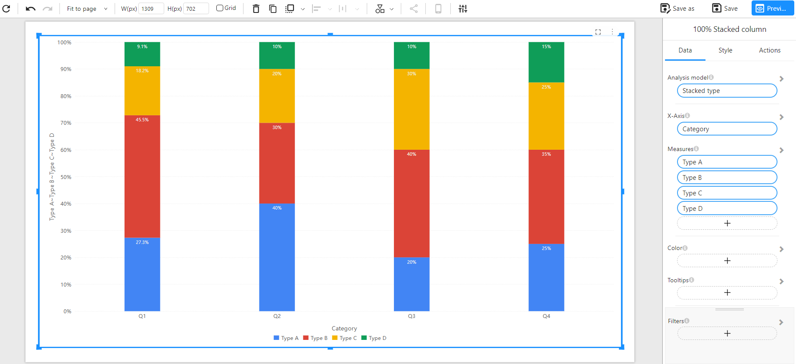
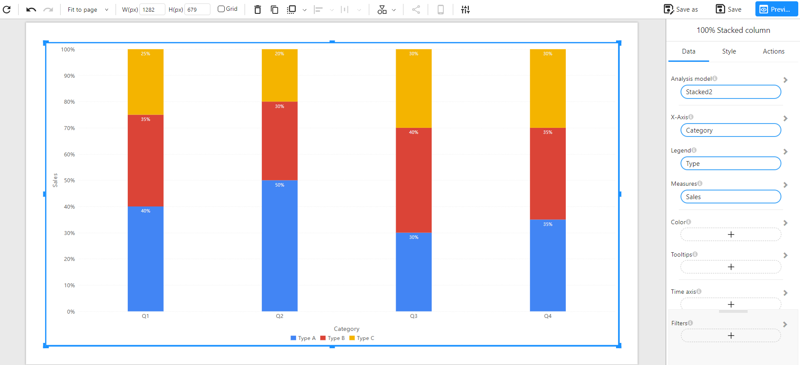

# 100% Stacked Column Chart

## Overview

A **100% Stacked Column Chart** visualizes the percentage distribution of multiple data series in vertical bars. Each bar represents a category, and its height is always 100%, divided by segments that show the relative contribution of each series.

This chart is ideal for highlighting **compositional differences** across groups, such as regional market share, category-based breakdowns, or survey responses.

### When to Use

- To compare **percentage composition** between categories.
- To visualize **distribution trends** without concern for absolute values.
- To normalize different categories and compare their **internal structure**.

---

## Data Structure

100% Stacked Column Charts support two primary data formats:

---

### **Method 1: Wide Table Format (Multiple Measures)**

Each column represents a separate category value, and each row corresponds to one bar in the chart. Each measure (e.g., Type A, Type B) contributes to the height of the column, which totals to 100%.

**Component Configuration**:
- **X-Axis**: Category
- **Measures**: Type A, Type B, Type C, Type D

**Example Data**:

| Category | Type A | Type B | Type C | Type D |
| -------- | ------ | ------ | ------ | ------ |
| Q1       | 30     | 50     | 20     | 10     |
| Q2       | 40     | 30     | 20     | 10     |
| Q3       | 20     | 40     | 30     | 10     |
| Q4       | 25     | 35     | 25     | 15     |

**Chart Example**:

---

### **Method 2: Long Table Format (Dimension + Measure)**

Each row includes one category-type pair with a value, allowing for more flexible and scalable datasets. Useful when data is in normalized or transactional format.

**Component Configuration**:
- **X-Axis**: Category
- **Legend**: Type
- **Measures**: Sales

**Example Data**:

| Category | Type   | Sales |
| -------- | ------ | ----- |
| Q1       | Type A | 40    |
| Q1       | Type B | 35    |
| Q1       | Type C | 25    |
| Q2       | Type A | 50    |
| Q2       | Type B | 30    |
| Q2       | Type C | 20    |
| Q3       | Type A | 30    |
| Q3       | Type B | 40    |
| Q3       | Type C | 30    |
| Q4       | Type A | 35    |
| Q4       | Type B | 35    |
| Q4       | Type C | 30    |

**Chart Example**:

---

## Notes

- Each column totals to **100%**, regardless of the raw values.
- **Colors** represent different data series (e.g., Type A, B, C...).
- Use **tooltips** to display both raw values and percentages.
- Supports **filters**, **color mapping**, and **time axis** for dynamic exploration.