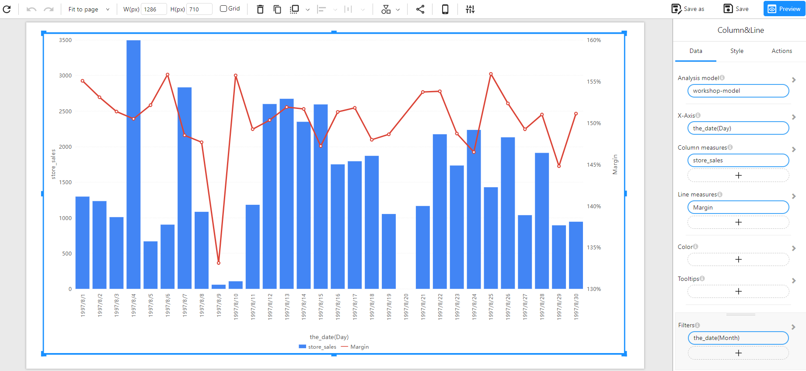

# Combo Chart

## Overview

A **Combo Chart** is a combination of a bar chart and a line chart. It is useful for comparing two different measures, where one is represented as a column and the other as a line.

### When to Use

- To **compare two different measures** with different scales (e.g., store sales vs. margin percentage).
- To **analyze trends and distributions** in the same visualization.
- To **highlight relationships** between two numerical variables.

## Data Structure

A **Column & Line Chart** requires:

- **X-Axis**: A time-based or categorical field (e.g., `the_date(Day)`).
- **Column Measures**: A numerical field representing the bar values (e.g., `store_sales`).
- **Line Measures**: A numerical field representing the trend line (e.g., `Margin`).
- **Filters (Optional)**: Used to refine the displayed data (e.g., filtering by month, category, or region).

### Example Data Structure

| the_date(Day) | store_sales | Margin |
| ------------- | ----------- | ------ |
| 1997-08-01    | 1200        | 155%   |
| 1997-08-02    | 1100        | 150%   |
| 1997-08-03    | 1000        | 145%   |
| 1997-08-04    | 950         | 140%   |
| 1997-08-05    | 1300        | 160%   |
| 1997-08-06    | 500         | 135%   |

## How to Configure

1. **Select the Analysis Model**: Choose the dataset containing the necessary fields.

2. **Set X-Axis**: Choose a time-based or categorical field (e.g., `the_date(Day)`).

3. **Set Column Measures**: Select a numerical field to be represented as bars (e.g., `store_sales`).

4. **Set Line Measures**: Choose a numerical field to be represented as a line (e.g., `Margin`).

5. Optional Customization:

   - **Color**: Assign different colors for better distinction.
   - **Tooltips**: Show additional details when hovering over data points.
   - **Filters**: Apply filters to refine data (e.g., `the_date(Month)`).

## Example

The following example visualizes **store sales as columns and margin as a line** over a period of time.

