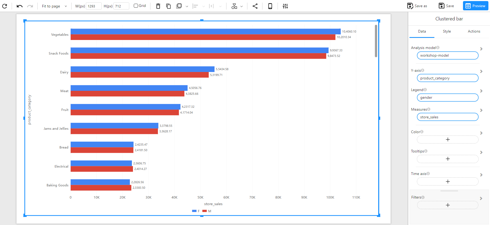
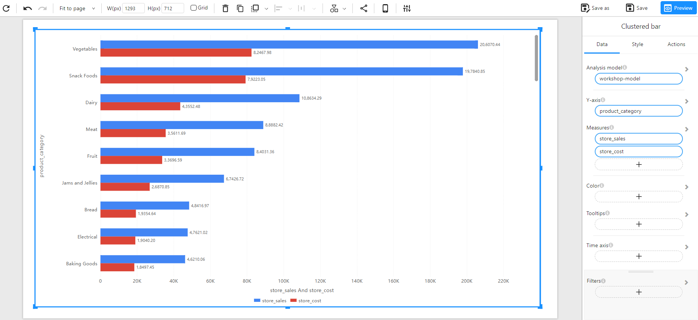

# Clustered Bar Chart

## Overview

A **Clustered Bar Chart** is used to compare multiple categories side by side. Each category is divided into sub-groups, represented by separate bars, making it easy to analyze patterns and differences across multiple dimensions.

### When to Use

- To **compare different groups** within a category (e.g., sales performance by gender for each product category).
- To **visualize multiple measures** within the same category (e.g., sales vs. cost per product category).
- To **identify trends and differences** between sub-groups.

## Data Structure

A **Clustered Bar Chart** requires:

- **Y-Axis**: A categorical field representing the primary category (e.g., `product_category`).
- **Legend (Optional)**: A categorical field that defines the sub-grouping within each category (e.g., `gender`).
- **Measures**: One or more numerical fields that represent the values for comparison (e.g., `store_sales`, `store_cost`).
- **Color(Optional):** Used to set the color of the chart based on categories or numerical values (intensity-based coloring, or using a categorical field for distinct colors).
- **Tooltips(Optional)**: Show additional details when hovering over bars.
- **Filters (Optional)**: Used to refine the data displayed (e.g., filtering by time, region, or product type).

### Example Data Structure

| product_category | gender | store_sales | store_cost |
| ---------------- | ------ | ----------- | ---------- |
| Vegetables       | F      | 104060.10   | 82467.98   |
| Vegetables       | M      | 102010.34   | 0          |
| Snack Foods      | F      | 99367.33    | 79223.05   |
| Snack Foods      | M      | 98473.52    | 0          |
| Dairy            | F      | 55434.58    | 43552.48   |
| Dairy            | M      | 53199.71    | 0          |

## How to Configure

### Comparing a Single Measure

### Comparing Multiple Measures

