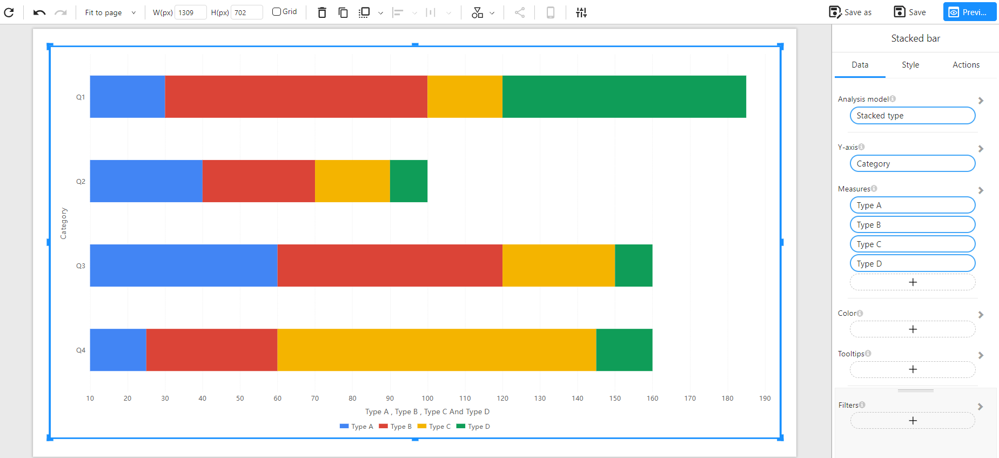

# Stacked Bar Chart

## Overview

A **Stacked Bar Chart** displays data using horizontal bars stacked by series. It helps visualize the **total value** of each category along with the **individual contribution** of each sub-category, making it ideal for composition analysis when vertical space is limited or when horizontal labels are more readable.

### When to Use

- To analyze both **total values** and **component contributions**.
- To show part-to-whole relationships across categories.
- When your category labels are long or need more space.
- To emphasize **horizontal comparisons**.

---

## Data Structure

Stacked Bar Charts support two standard data structures:

---

### **Method 1: Wide Table Format (Multiple Measures)**

Each sub-category (e.g., Type A, Type B...) is a separate column, and each row represents one bar (e.g., Q1, Q2...).

**Component Configuration**:
- **Y-Axis**: Category
- **Measures**: Type A, Type B, Type C, Type D

**Example Data**:

| Category | Type A | Type B | Type C | Type D |
| -------- | ------ | ------ | ------ | ------ |
| Q1       | 30     | 70     | 20     | 65     |
| Q2       | 40     | 30     | 20     | 10     |
| Q3       | 60     | 60     | 30     | 10     |
| Q4       | 25     | 35     | 85     | 15     |

**Chart Example**:

---

### **Method 2: Long Table Format (Dimension + Measure)**

Each row includes a category–type pair and a numeric value. This normalized format is common in real-world datasets.

**Component Configuration**:
- **Y-Axis**: Category
- **Legend**: Type
- **Measure**: Sales

**Example Data**:

| Category | Type   | Sales |
| -------- | ------ | ----- |
| Q1       | Type A | 40    |
| Q1       | Type B | 55    |
| Q1       | Type C | 25    |
| Q2       | Type A | 50    |
| Q2       | Type B | 30    |
| Q2       | Type C | 15    |
| Q3       | Type A | 30    |
| Q3       | Type B | 40    |
| Q3       | Type C | 70    |
| Q4       | Type A | 35    |
| Q4       | Type B | 45    |
| Q4       | Type C | 30    |

**Chart Example**:

---

## Notes

- The **total length** of each bar represents the overall value.
- **Colors** differentiate sub-categories within each bar.
- You can enable **data labels** and adjust **label position** (left, right, inside).
- Works well for **categorical comparisons**, especially when category names are long.
- Supports additional options such as filters, colors, tooltips, and time axis.