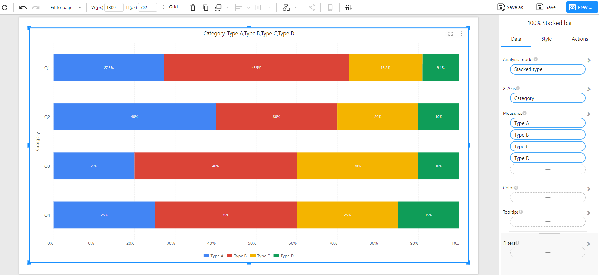
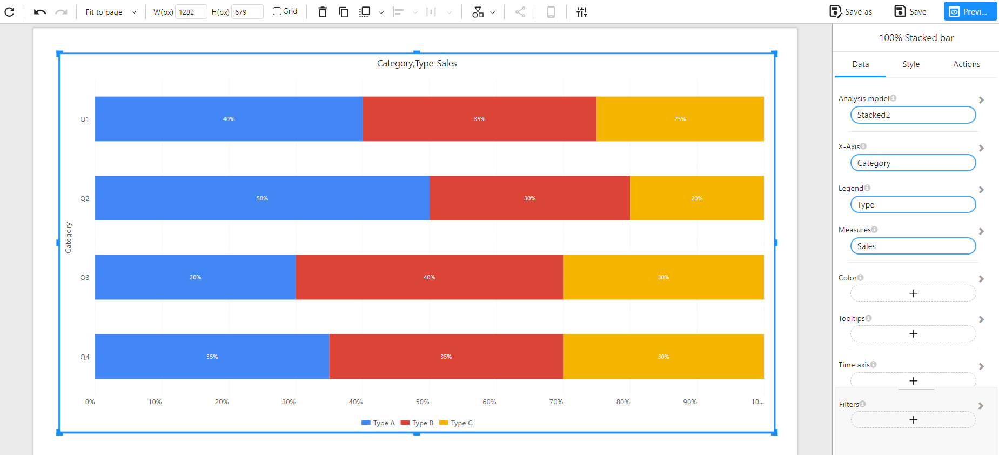

# 100% Stacked Bar Chart

## Overview

A **100% Stacked Bar Chart** displays the relative percentage of multiple data series stacked in a single bar, with the total always equaling 100%. It allows you to compare the proportion of categories across different groups, regardless of the total values.

This chart is useful when the focus is on **percentage contribution** rather than actual values, such as analyzing product mix, sales channel contribution, or regional share.

### When to Use

- To compare **proportions** of components within categories.
- To normalize data where total values differ but **percentage distribution matters**.
- To show **trends in composition** across multiple groups (e.g., quarters, regions).

## Data Structure

100% Stacked Bar Charts support two ways of defining data:

### **Method 1: Wide Table Format (Multiple Measures)**

Each category (e.g., Q1, Q2...) has separate columns for each series to be stacked (e.g., Type A, Type B...). The chart aggregates values from each column and normalizes them to percentages.

**Component Configuration**:
- **X-Axis**: Category
- **Measures**: Type A, Type B, Type C, Type D

**Example Data**:

| Category | Type A | Type B | Type C | Type D |
| -------- | ------ | ------ | ------ | ------ |
| Q1       | 30     | 50     | 20     | 10     |
| Q2       | 40     | 30     | 20     | 10     |
| Q3       | 20     | 40     | 30     | 10     |
| Q4       | 25     | 35     | 25     | 15     |

**Chart Example**:

### **Method 2: Long Table Format (Dimension + Measure)**

Each row represents a category–type pair with its value. This format is more normalized and scalable, especially for large or dynamic datasets.

**Component Configuration**:
- **X-Axis**: Category
- **Legend**: Type
- **Measures**: Sales

**Example Data**:

| Category | Type   | Sales |
| -------- | ------ | ----- |
| Q1       | Type A | 40    |
| Q1       | Type B | 35    |
| Q1       | Type C | 25    |
| Q2       | Type A | 50    |
| Q2       | Type B | 30    |
| Q2       | Type C | 20    |
| Q3       | Type A | 30    |
| Q3       | Type B | 40    |
| Q3       | Type C | 30    |
| Q4       | Type A | 35    |
| Q4       | Type B | 35    |
| Q4       | Type C | 30    |

**Chart Example**:

## Notes

- The **total value of each bar equals 100%**, regardless of actual numeric totals.
- **Tooltips** typically show both percentage and raw value.
- Ideal for showing **composition** where absolute differences are less important than **proportional contribution**.
- You can use **Color** settings to control the color scheme for each segment.