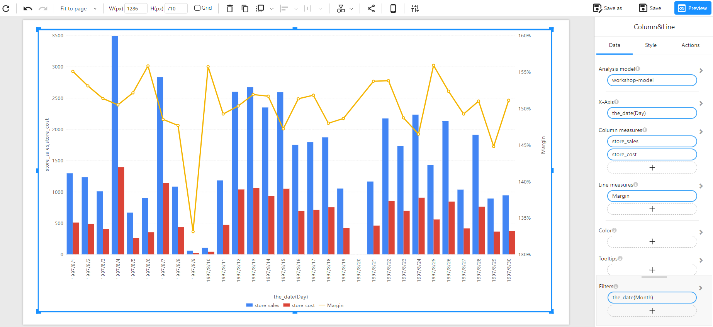

# Combo Chart

## Overview

A **Combo Chart** is a combination of a bar chart and a line chart. It is useful for comparing multiple measures, where some are represented as columns and others as lines.

### When to Use

- To **compare two different measures** with different scales (e.g., store sales vs. margin percentage).
- To **analyze trends and distributions** in the same visualization.
- To **highlight relationships** between two numerical variables.

## Data Structure

A **Combo Chart** requires:

- **X-Axis**: A time-based or categorical field (e.g., `the_date(Day)`).
- **Column Measures**: One or more numerical fields representing the bar values (e.g., `store_sales`, `store_invoice`).
- **Line Measures**: One or more numerical fields representing the trend lines (e.g., `Margin`, `store_cost`).
- **Color(Optional)**: Assign different colors for better distinction.
- **Tooltips(Optional)**: Show additional details when hovering over data points.
- **Filters (Optional)**: Used to refine the displayed data (e.g., filtering by month, category, or region).

### Example Data Structure

| the_date(Day) | store_sales | store_invoice | Margin |
| ------------- | ----------- | ------------- | ------ |
| 1997-08-01    | 1200        | 900           | 155%   |
| 1997-08-02    | 1100        | 870           | 150%   |
| 1997-08-03    | 1000        | 850           | 145%   |
| 1997-08-04    | 950         | 820           | 140%   |
| 1997-08-05    | 1300        | 1000          | 160%   |
| 1997-08-06    | 500         | 400           | 135%   |

## Example

The following example visualizes **store sales, store_cost as columns and margin as a line** over a period of time.

