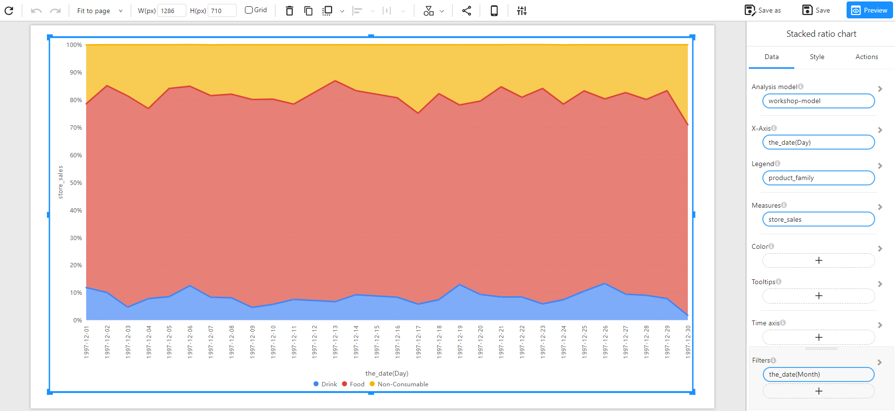
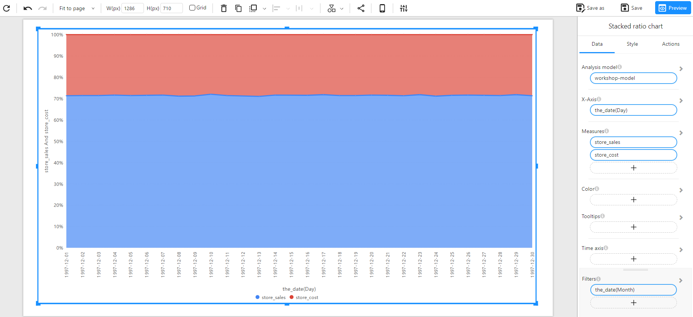

# Stacked Ratio Chart

## Overview

A **Stacked Ratio Chart** is used to represent the proportion of different categories over time or across a dimension. Unlike a traditional stacked area chart that shows absolute values, the stacked ratio chart normalizes data to 100%, making it easier to compare category distributions at different points.

### When to Use

- To **visualize proportional changes** over time.
- To **compare category contributions** within a total measure.
- To **highlight trends in data composition** rather than absolute values.
- To **analyze a single measure or compare multiple measures**, similar to a pie chart.

## Data Structure

A **Stacked Ratio Chart** requires:

- **X-Axis**: A date-type or categorical field representing the dimension (e.g., `the_date (Day)`).
- **Legend**: A categorical field that differentiates the stacked segments (e.g., `product_family`).
- **Measures**: One or more numerical fields representing the total value to be divided into proportions (e.g., `store_sales`, `store_cost`).
- **Color (Optional)**: Used to assign colors to different categories based on a categorical or numerical field.
- **Tooltips (Optional)**: Displays additional information when hovering over the chart.
- **Filters (Optional)**: Allows refining the displayed data (e.g., filtering by time, region, or product type).

### Example Data Structure

| the_date   | product_family | store_sales | store_cost |
| ---------- | -------------- | ----------- | ---------- |
| 1997-12-01 | Drink          | 500         | 200        |
| 1997-12-01 | Food           | 4000        | 1500       |
| 1997-12-01 | Non-Consumable | 1000        | 700        |
| 1997-12-02 | Drink          | 450         | 180        |
| 1997-12-02 | Food           | 4100        | 1600       |
| 1997-12-02 | Non-Consumable | 950         | 720        |

## How to Configure

### Analyzing a Single Measure

1. **Select the Analysis Model**: Choose the dataset containing the required fields.
2. **Set the X-Axis**: Select a date-type or categorical field (e.g., `the_date (Day)`).
3. **Set the Measure**: Choose a single numerical field representing the total values (e.g., `store_sales`).
4. **Set the Legend**: Select a categorical field to define the stacked categories (e.g., `product_family`).

### Comparing Multiple Measures

1. **Select Multiple Measures**: Instead of a single measure, choose multiple numerical fields (e.g., `store_sales` and `store_cost`).
2. **Stack Different Measures**: Each measure will be represented as a separate stacked ratio within the chart.

### Optional Customization

- **Set Color**: Assign colors based on a category or numerical intensity.
- **Enable Tooltips**: Display additional insights when hovering over data points.
- **Apply Filters**: Refine data display using time-based or categorical filters.

## Example

### Stacked Ratio Chart with a Single Measure

### Stacked Ratio Chart with Multiple Measures

