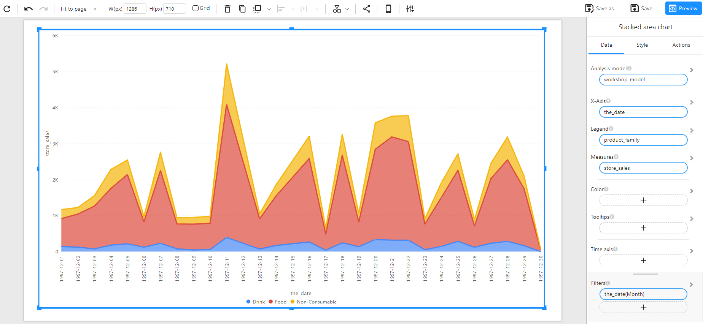

# Stacked Area Chart

## Overview

A **Stacked Area Chart** is used to visualize trends over time, where multiple categories are stacked on top of one another. This helps in understanding both the total value and the contribution of individual components. It is particularly useful when comparing trends among multiple groups while also showing their cumulative effect.

### When to Use

- To **analyze trends** in data over time while maintaining visibility into category contributions.
- To **compare multiple categories** that collectively contribute to a total.
- To **identify seasonal patterns** or fluctuations in grouped data.

## Data Structure

A **Stacked Area Chart** requires:

- **X-Axis**: A time-based dimension (e.g., Date, Month, Year) to track trends over time.
- **Legend**: A categorical field to represent different groups contributing to the total (e.g., Product Family, Department).
- **Measures**: A numerical value representing the metric to be analyzed (e.g., Sales, Revenue, Quantity Sold).
- **Color(Optional):** Used to set the color of the chart based on categories or numerical values (intensity-based coloring, or using a categorical field for distinct colors).
- **Tooltips(Optional)**: Show additional details when hovering over plot area.
- **Filters (Optional)**: Used to restrict the data displayed, such as filtering by month, region, or category.

### Example Data Structure

| the_date   | product_family | store_sales |
| ---------- | -------------- | ----------- |
| 1997-12-01 | Drink          | 200         |
| 1997-12-01 | Food           | 500         |
| 1997-12-01 | Non-Consumable | 300         |
| 1997-12-02 | Drink          | 250         |
| 1997-12-02 | Food           | 700         |
| 1997-12-02 | Non-Consumable | 400         |

## Example

The following example visualizes daily store sales across three product families (Drink, Food, Non-Consumable) for December 1997.

