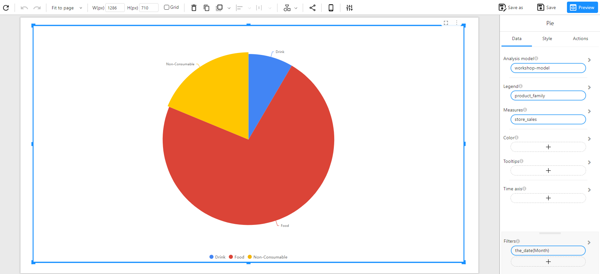
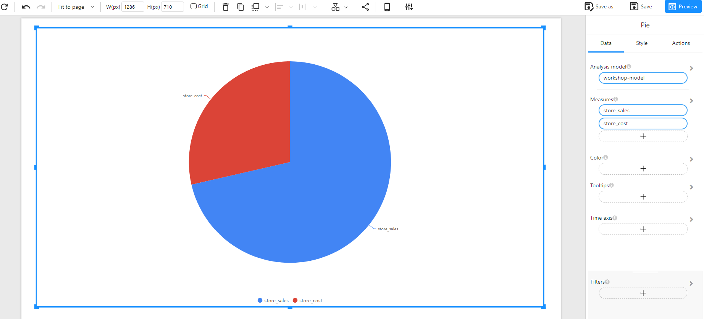

# Pie Chart

## Overview

A **Pie Chart** is used to represent proportions of a whole, displaying data as slices of a circle. Each slice corresponds to a category and its relative contribution to the total. This type of visualization is ideal for understanding distribution and comparison at a glance.

### When to Use

- To **show proportions** of a dataset where categories contribute to a whole.
- To **compare relative sizes** of groups without focusing on trends over time.
- To **simplify categorical data** into an easily interpretable format.

## Data Structure

A **Pie Chart** requires:

- **Legend**: A categorical field that defines different slices (e.g., Product Family, Department, Category).
- **Measures**: A numerical field representing the values that define the size of each slice (e.g., Sales, Revenue, Units Sold).
- **Color(Optional):** Used to set the color of the chart based on categories or numerical values (intensity-based coloring, or using a categorical field for distinct colors).
- **Tooltips(Optional)**: Show additional details when hovering over bars.
- **Filters (Optional)**: Used to refine the data displayed by the chart (e.g., filtering by month, region, or product type).

### Example Data Structure

| product_family | store_sales | store_cost |
| -------------- | ----------- | ---------- |
| Drink          | 4802.03     | 1925.31    |
| Food           | 41484.40    | 16562.05   |
| Non-Consumable | 10679.21    | 4258.77    |

### Comparing a Single Measure

### Comparing Multiple Measures

