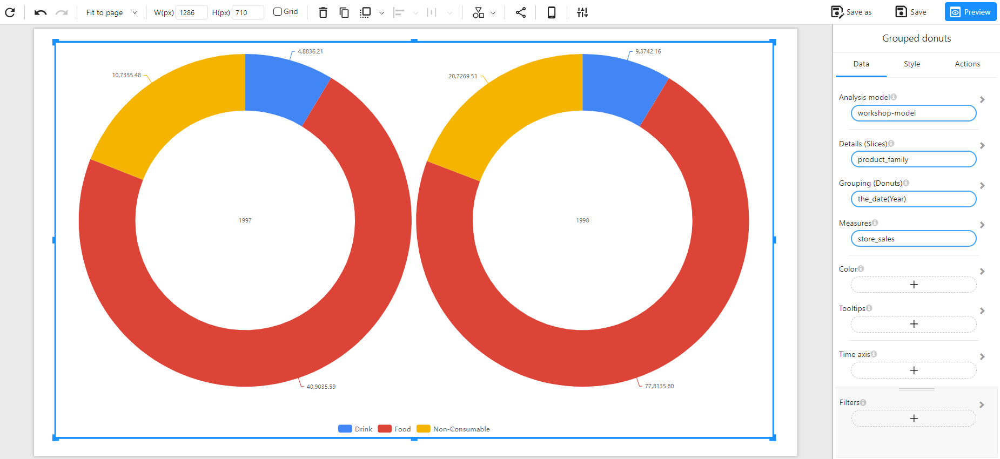

# Grouped Donut Chart

## Overview

A **Grouped Donut Chart** is used to compare proportions across multiple categories. It displays multiple donut charts side by side, where each donut represents a different group while maintaining the same categorical slices within each.

### When to Use

- To **compare proportions** within different groups (e.g., sales distribution by product family across multiple years).

## Data Structure

A **Grouped Donut Chart** requires:

- **Details (Slices)**: A categorical field defining the segments within each donut (e.g., `product_family`).
- **Grouping (Donuts)**: A categorical field used to create separate donut charts (e.g., `the_date(Year)`).
- **Measures**: A numerical field representing the values for each slice (e.g., `store_sales`).
- **Color (Optional)**: Used to set the color of the chart based on categories or numerical values.
- **Tooltips (Optional)**: Additional information displayed when hovering over slices.
- **Time Axis (Optional)**: Allows for time-based filtering.
- **Filters (Optional)**: Used to refine the displayed data (e.g., filtering by region or product type).

### Example Data Structure

| the_date (Year) | product_family | store_sales |
| --------------- | -------------- | ----------- |
| 1997            | Food           | 40,9035.59  |
| 1997            | Non-Consumable | 10,7355.48  |
| 1997            | Drink          | 4,8836.21   |
| 1998            | Food           | 77,8135.80  |
| 1998            | Non-Consumable | 20,7269.51  |
| 1998            | Drink          | 9,3742.16   |

## Example

