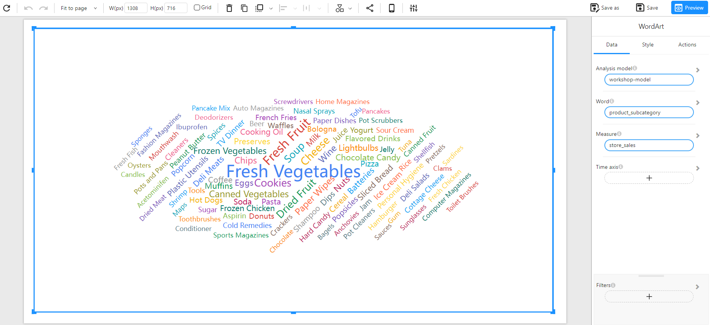

# Word Cloud Chart

## Overview

A **Word Cloud Chart** (also known as Word Art) is a visualization technique used to display text data, where the size of each word represents its importance or frequency within the dataset. This type of visualization helps quickly identify the most significant terms in a dataset.

### When to Use

- To **highlight key terms** or categories that appear frequently in a dataset.
- To **visualize categorical data** based on a numerical measure.
- To **quickly identify trends** in textual or categorized data.

## Data Structure

A **Word Cloud Chart** requires:

- **Word**: A categorical field that defines each unique word or term (e.g., `product_subcategory`).
- **Measure**: A numerical field that determines the size of each word (e.g., `store_sales`).
- **Filters (Optional)**: Used to refine the data displayed (e.g., filtering by time, category, or region).

### Example Data Structure

| product_subcategory | store_sales |
| ------------------- | ----------- |
| Fresh Vegetables    | 50000       |
| Frozen Chicken      | 25000       |
| Cheese              | 15000       |
| Chocolate Candy     | 12000       |
| Potato Chips        | 9000        |

## Example

The following example visualizes store sales by product subcategory, with more significant sales values represented by larger words.

