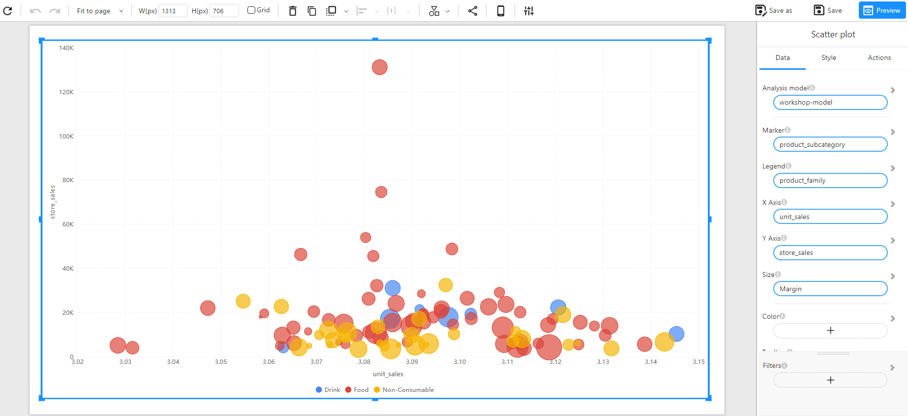

# Scatter Plot

## Overview

A **Scatter Plot** is a visualization technique that represents relationships between two numerical variables. Each point on the chart corresponds to an observation, helping to identify patterns, trends, and correlations between the variables.

### When to Use

- To **analyze relationships** between two numerical variables.
- To **detect clusters, trends, and outliers** in data.
- To **visualize correlations** between different measures (e.g., unit sales vs. store sales).
- To **represent multiple categories** with colors and different marker sizes.

## Data Structure

A **Scatter Plot** requires:

- **X-Axis**: A numerical field (e.g., `unit_sales`).
- **Y-Axis**: A numerical field (e.g., `store_sales`).
- **Marker**: A categorical field representing distinct groups (e.g., `product_subcategory`).
- **Legend**: A categorical field to differentiate data points by color (e.g., `product_family`).
- **Size (Optional)**: A numerical field to adjust the marker size based on values (e.g., `Margin`).
- **Filters (Optional)**: Used to refine the displayed data (e.g., by date, product type, or region).

### Example Data Structure

| product_subcategory | product_family | unit_sales | store_sales | Margin |
| ------------------- | -------------- | ---------- | ----------- | ------ |
| Fresh Vegetables    | Food           | 3.05       | 12000       | 200    |
| Frozen Chicken      | Food           | 3.12       | 35000       | 500    |
| Chocolate Candy     | Non-Consumable | 3.08       | 15000       | 300    |
| Soft Drinks         | Drink          | 3.10       | 18000       | 250    |
| Potato Chips        | Non-Consumable | 3.06       | 9000        | 150    |

## How to Configure

1. **Select the Analysis Model**: Choose the dataset containing the necessary fields.
2. **Set X-Axis**: Select a numerical field to represent the horizontal axis (e.g., `unit_sales`).
3. **Set Y-Axis**: Select a numerical field to represent the vertical axis (e.g., `store_sales`).
4. **Set Marker**: Choose a categorical field to define unique data points (e.g., `product_subcategory`).
5. **Set Legend**: Select a categorical field to differentiate points by color (e.g., `product_family`).
6. **Optional Customization**:
   - **Size**: Use a numerical field to adjust marker sizes dynamically (e.g., `Margin`).
   - **Color**: Customize colors to represent different groups.
   - **Filters**: Apply filters to refine displayed data (e.g., `Date`, `Region`).

## Example

The following example visualizes the relationship between **unit sales** and **store sales** across different product subcategories, with marker size representing the **Margin**.

