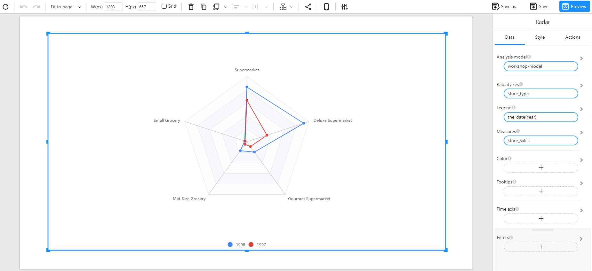

# Radar Chart

## Overview

A **Radar Chart** (also known as a Spider Chart) is used to visualize multi-dimensional data across multiple categories. Each axis represents a different category, and data points are connected to form a polygon, making it easy to compare different groups across various criteria.

### When to Use

- To **compare multiple categories** across different dimensions (e.g., store sales by store type over multiple years).
- To **identify strengths and weaknesses** across various attributes.
- To **analyze performance** of different groups on multiple metrics.

## Data Structure

A **Radar Chart** requires:

- **Radial Axes**: A categorical field representing different attributes or categories (e.g., `store_type`).
- **Legend (Optional)**: A categorical field that differentiates different groups (e.g., `the_date(Year)`).
- **Measures**: A numerical field that defines the values plotted on the radar chart (e.g., `store_sales`).
- **Color(Optional):** Used to set the color of the chart based on categories or numerical values (intensity-based coloring, or using a categorical field for distinct colors).
- **Filters (Optional)**: Used to refine the displayed data (e.g., filtering by region, product category).

### Example Data Structure

| store_type          | the_date(Year) | store_sales |
| ------------------- | -------------- | ----------- |
| Supermarket         | 1997           | 50000       |
| Deluxe Supermarket  | 1997           | 25000       |
| Small Grocery       | 1997           | 12000       |
| Mid-Size Grocery    | 1997           | 10000       |
| Gourmet Supermarket | 1997           | 8000        |
| Supermarket         | 1998           | 70000       |
| Deluxe Supermarket  | 1998           | 40000       |
| Small Grocery       | 1998           | 15000       |
| Mid-Size Grocery    | 1998           | 12000       |
| Gourmet Supermarket | 1998           | 10000       |

## Example

The following example shows a comparison of store sales across different store types for the years **1997** and **1998**.

