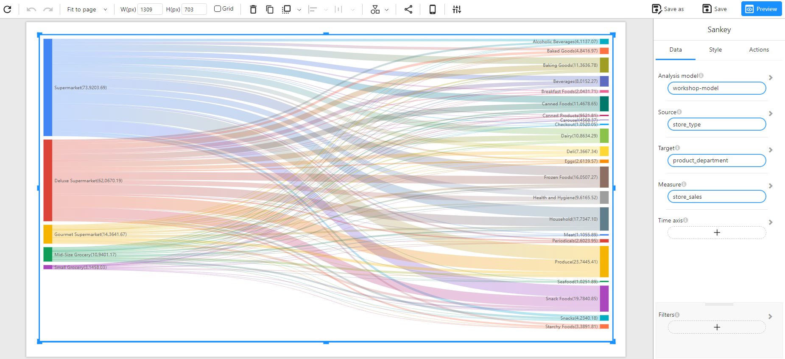

# Sankey Chart

## Overview

A **Sankey Chart** is used to visualize the flow of values between different categories. It represents relationships as paths where the width of the path is proportional to the flow magnitude. This chart is especially useful for understanding distributions, process flows, and hierarchical relationships.

### When to Use

- To **analyze flow distribution** between different categories.
- To **visualize relationships** between multiple groups.
- To **track data movement** across multiple stages or departments.

## Data Structure

A **Sankey Chart** requires:

- **Source**: A categorical field representing the starting point of the flow (e.g., `store_type`).
- **Target**: A categorical field representing the destination of the flow (e.g., `product_department`).
- **Measure**: A numerical field representing the flow magnitude (e.g., `store_sales`).
- **Filters (Optional)**: Used to refine the displayed data (e.g., filtering by time, region, or category).

### Example Data Structure

| store_type          | product_department | store_sales |
| ------------------- | ------------------ | ----------- |
| Supermarket         | Produce            | 237445.41   |
| Deluxe Supermarket  | Dairy              | 108634.29   |
| Gourmet Supermarket | Meat               | 11055.89    |
| Mid-Size Grocery    | Seafood            | 10251.89    |
| Small Grocery       | Baked Goods        | 48416.97    |

## Example

The following example visualizes **store sales flow from store types to product departments**.

