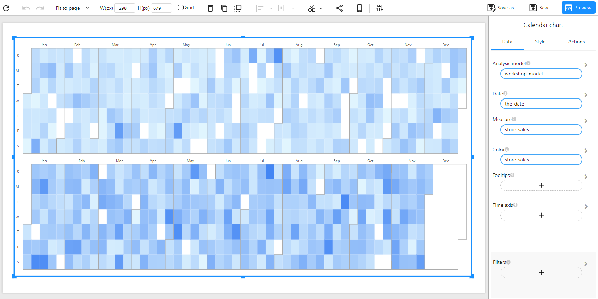

# Calendar Chart

## Overview

A **Calendar Chart** is used to visualize data over a time period in a heatmap format. It represents values for each day of the year, with different intensities of color indicating higher or lower values. This type of chart is useful for identifying trends, seasonality, and anomalies within time-based data.

### When to Use

- To **analyze daily trends** over a year or longer periods.
- To **detect patterns** of high or low activity across different days.
- To **compare performance across different years or categories**.

## Data Structure

A **Calendar Chart** requires:

- **Date**: A date-type field that represents the timeline (e.g., `the_date`).
- **Measure**: A numerical field representing the values mapped to the heatmap (e.g., `store_sales`).
- **Color (Optional)**: A numerical field to define the color intensity (e.g., `store_sales` to visualize sales volume by day).
- **Tooltips (Optional)**: Additional information to be displayed when hovering over data points.
- **Filters (Optional)**: Used to refine the displayed data (e.g., filtering by region, category, or year).

### Example Data Structure

| the_date   | store_sales | 
| ---------- | ----------- | 
| 2023-01-01 | 1200        |
| 2023-01-02 | 950         |
| 2023-01-03 | 1800        | 
| 2023-01-04 | 2000        |
| 2023-01-05 | 1700        | 
| 2023-01-06 | 1400        | 

## Example

The following example visualizes **store sales distributed across the calendar year**.

